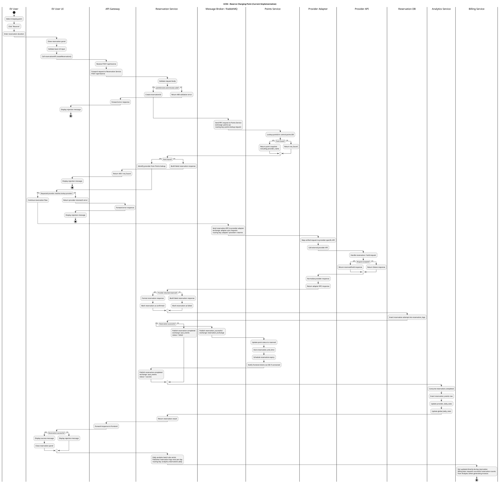
```plantuml
@startuml
title UC02 - Reserve Charging Point (Current Implementation)

|EV User|
start
:Select charging point;
:Click "Reserve";
:Enter reservation duration;

|EV User UI|
:Show reservation panel;
:Validate basic UI input;
:Call reservationAPI.createReservation();

|API Gateway|
:Receive POST /api/reserve;
:Forward request to Reservation Service\nPOST /api/reserve;

|Reservation Service|
:Validate request body;
if (pointId exists and minutes valid?) then (yes)
  :Create reservationId;
else (no)
  :Return 400 validation error;
  |API Gateway|
  :Forward error response;
  |EV User UI|
  :Display rejection message;
  stop
endif

|Message Broker / RabbitMQ|
:Send RPC request to Points Service\nexchange: points.rpc\nrouting key: points.lookup.request;

|Points Service|
:Lookup pointId in central points DB;
if (Point found?) then (yes)
  :Return point snapshot\nincluding provider_name;
else (no)
  :Return not_found;
endif

|Reservation Service|
if (Point found?) then (yes)
  :Identify provider from Points lookup;
else (no)
  :Build failed reservation response;
  |API Gateway|
  :Return 409 / not_found;
  |EV User UI|
  :Display rejection message;
  stop
endif

if (Requested provider matches lookup provider?) then (yes)
  :Continue reservation flow;
else (no)
  :Return provider mismatch error;
  |API Gateway|
  :Forward error response;
  |EV User UI|
  :Display rejection message;
  stop
endif

|Message Broker / RabbitMQ|
:Send reservation RPC to provider adapter\nexchange: adapter.sync.requests\nrouting key: adapter.<provider>.reserve;

|Provider Adapter|
:Map unified request to provider-specific API;
:Call external provider API;

|Provider API|
:Handle reservation / hold request;
if (Request accepted?) then (yes)
  :Return reserved/held response;
else (no)
  :Return failure response;
endif

|Provider Adapter|
:Normalize provider response;
:Return adapter RPC response;

|Reservation Service|
if (Provider returned reserved?) then (yes)
  :Format reservation response;
  :Mark reservation as confirmed;
else (no)
  :Build failed reservation response;
  :Mark reservation as failed;
endif

|Reservation DB|
:Insert reservation attempt into reservation_logs;

|Reservation Service|
if (Reservation successful?) then (yes)
  |Message Broker / RabbitMQ|
  :Publish reservation_successful\nexchange: reservation_exchange;

  |Points Service|
  :Update point status to reserved;
  :Store reservation_end_time;
  :Schedule reservation expiry;
  :Notify frontend clients via SSE if connected;

  |Reservation Service|
  :Publish reservation.completed\nexchange: saas_events\nstatus = success;
else (no)
  :Publish reservation.completed\nexchange: saas_events\nstatus = failed;
endif

|Analytics Service|
:Consume reservation.completed;
:Insert reservation_events row;
:Update provider_daily_stats;
:Update global_daily_stats;

|Reservation Service|
:Return reservation result;

|API Gateway|
:Forward response to frontend;

|EV User UI|
if (Reservation successful?) then (yes)
  :Display success message;
  :Close reservation panel;
else (no)
  :Display rejection message;
endif

|Reservation Service|
:Daily analytics batch also exists\nPublishes reservation logs once per day\nrouting key: analytics.reservations.daily;

|Billing Service|
:Not updated directly during reservation\nBilling later requests successful reservation counts\nfrom Analytics when generating invoices;

stop
@enduml
```

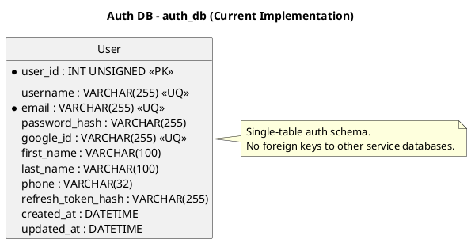
```plantuml
@startuml
' ER - Auth DB
title Auth DB - auth_db (Current Implementation)

hide circle
skinparam linetype ortho

entity "User" as User {
  * user_id : INT UNSIGNED <<PK>>
  --
  username : VARCHAR(255) <<UQ>>
  * email : VARCHAR(255) <<UQ>>
  password_hash : VARCHAR(255)
  google_id : VARCHAR(255) <<UQ>>
  first_name : VARCHAR(100)
  last_name : VARCHAR(100)
  phone : VARCHAR(32)
  refresh_token_hash : VARCHAR(255)
  created_at : DATETIME
  updated_at : DATETIME
}

note right of User
Single-table auth schema.
No foreign keys to other service databases.
end note

@enduml
```

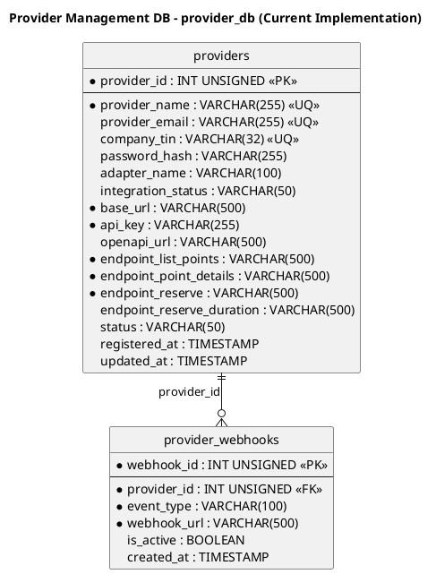
```plantuml
@startuml
' ER - Provider Management DB
title Provider Management DB - provider_db (Current Implementation)

hide circle
skinparam linetype ortho

entity "providers" as providers {
  * provider_id : INT UNSIGNED <<PK>>
  --
  * provider_name : VARCHAR(255) <<UQ>>
  provider_email : VARCHAR(255) <<UQ>>
  company_tin : VARCHAR(32) <<UQ>>
  password_hash : VARCHAR(255)
  adapter_name : VARCHAR(100)
  integration_status : VARCHAR(50)
  * base_url : VARCHAR(500)
  * api_key : VARCHAR(255)
  openapi_url : VARCHAR(500)
  * endpoint_list_points : VARCHAR(500)
  * endpoint_point_details : VARCHAR(500)
  * endpoint_reserve : VARCHAR(500)
  endpoint_reserve_duration : VARCHAR(500)
  status : VARCHAR(50)
  registered_at : TIMESTAMP
  updated_at : TIMESTAMP
}

entity "provider_webhooks" as provider_webhooks {
  * webhook_id : INT UNSIGNED <<PK>>
  --
  * provider_id : INT UNSIGNED <<FK>>
  * event_type : VARCHAR(100)
  * webhook_url : VARCHAR(500)
  is_active : BOOLEAN
  created_at : TIMESTAMP
}

providers ||--o{ provider_webhooks : "provider_id"

@enduml
```

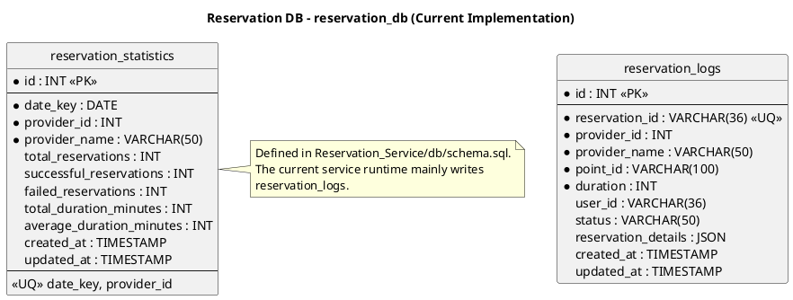
```plantuml
@startuml
' ER - Reservation DB
title Reservation DB - reservation_db (Current Implementation)

hide circle
skinparam linetype ortho

entity "reservation_logs" as reservation_logs {
  * id : INT <<PK>>
  --
  * reservation_id : VARCHAR(36) <<UQ>>
  * provider_id : INT
  * provider_name : VARCHAR(50)
  * point_id : VARCHAR(100)
  * duration : INT
  user_id : VARCHAR(36)
  status : VARCHAR(50)
  reservation_details : JSON
  created_at : TIMESTAMP
  updated_at : TIMESTAMP
}

entity "reservation_statistics" as reservation_statistics {
  * id : INT <<PK>>
  --
  * date_key : DATE
  * provider_id : INT
  * provider_name : VARCHAR(50)
  total_reservations : INT
  successful_reservations : INT
  failed_reservations : INT
  total_duration_minutes : INT
  average_duration_minutes : INT
  created_at : TIMESTAMP
  updated_at : TIMESTAMP
  --
  <<UQ>> date_key, provider_id
}

note right of reservation_statistics
Defined in Reservation_Service/db/schema.sql.
The current service runtime mainly writes
reservation_logs.
end note

@enduml
```

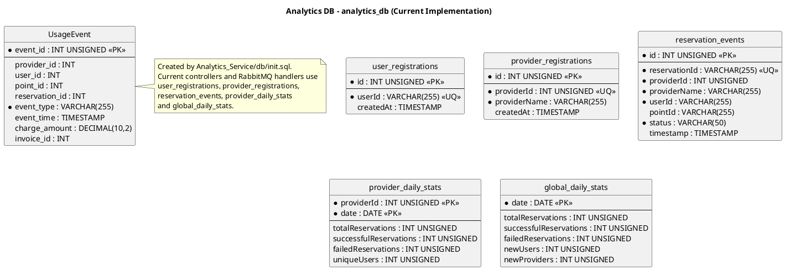
```plantuml
@startuml
' ER - Analytics DB
title Analytics DB - analytics_db (Current Implementation)

hide circle
skinparam linetype ortho

entity "user_registrations" as user_registrations {
  * id : INT UNSIGNED <<PK>>
  --
  * userId : VARCHAR(255) <<UQ>>
  createdAt : TIMESTAMP
}

entity "provider_registrations" as provider_registrations {
  * id : INT UNSIGNED <<PK>>
  --
  * providerId : INT UNSIGNED <<UQ>>
  * providerName : VARCHAR(255)
  createdAt : TIMESTAMP
}

entity "reservation_events" as reservation_events {
  * id : INT UNSIGNED <<PK>>
  --
  * reservationId : VARCHAR(255) <<UQ>>
  * providerId : INT UNSIGNED
  * providerName : VARCHAR(255)
  * userId : VARCHAR(255)
  pointId : VARCHAR(255)
  * status : VARCHAR(50)
  timestamp : TIMESTAMP
}

entity "provider_daily_stats" as provider_daily_stats {
  * providerId : INT UNSIGNED <<PK>>
  * date : DATE <<PK>>
  --
  totalReservations : INT UNSIGNED
  successfulReservations : INT UNSIGNED
  failedReservations : INT UNSIGNED
  uniqueUsers : INT UNSIGNED
}

entity "global_daily_stats" as global_daily_stats {
  * date : DATE <<PK>>
  --
  totalReservations : INT UNSIGNED
  successfulReservations : INT UNSIGNED
  failedReservations : INT UNSIGNED
  newUsers : INT UNSIGNED
  newProviders : INT UNSIGNED
}

entity "UsageEvent" as UsageEvent {
  * event_id : INT UNSIGNED <<PK>>
  --
  provider_id : INT
  user_id : INT
  point_id : INT
  reservation_id : INT
  * event_type : VARCHAR(255)
  event_time : TIMESTAMP
  charge_amount : DECIMAL(10,2)
  invoice_id : INT
}

note right of UsageEvent
Created by Analytics_Service/db/init.sql.
Current controllers and RabbitMQ handlers use
user_registrations, provider_registrations,
reservation_events, provider_daily_stats
and global_daily_stats.
end note

@enduml
```

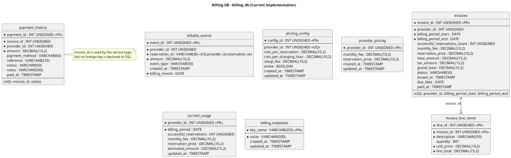
```plantuml
@startuml
' ER - Billing DB
title Billing DB - billing_db (Current Implementation)

hide circle
skinparam linetype ortho

entity "billable_events" as billable_events {
  * event_id : INT UNSIGNED <<PK>>
  --
  * provider_id : INT UNSIGNED
  * reservation_id : VARCHAR(36) <<UQ provider_id,reservation_id>>
  * amount : DECIMAL(10,2)
  event_type : VARCHAR(50)
  created_at : TIMESTAMP
  * billing_month : DATE
}

entity "invoices" as invoices {
  * invoice_id : INT UNSIGNED <<PK>>
  --
  * provider_id : INT UNSIGNED
  * billing_period_start : DATE
  * billing_period_end : DATE
  successful_reservations_count : INT UNSIGNED
  monthly_fee : DECIMAL(10,2)
  reservation_price : DECIMAL(10,2)
  total_amount : DECIMAL(15,2)
  tax_amount : DECIMAL(15,2)
  grand_total : DECIMAL(15,2)
  status : VARCHAR(50)
  issued_at : TIMESTAMP
  due_date : DATE
  paid_at : TIMESTAMP
  --
  <<UQ>> provider_id, billing_period_start, billing_period_end
}

entity "invoice_line_items" as invoice_line_items {
  * line_id : INT UNSIGNED <<PK>>
  --
  * invoice_id : INT UNSIGNED <<FK>>
  * description : VARCHAR(255)
  quantity : INT
  * unit_price : DECIMAL(10,2)
  * line_total : DECIMAL(15,2)
}

entity "pricing_config" as pricing_config {
  * config_id : INT UNSIGNED <<PK>>
  --
  provider_id : INT UNSIGNED <<UQ>>
  cost_per_reservation : DECIMAL(10,2)
  cost_per_charging_hour : DECIMAL(10,2)
  setup_fee : DECIMAL(10,2)
  active : BOOLEAN
  created_at : TIMESTAMP
  updated_at : TIMESTAMP
}

entity "provider_pricing" as provider_pricing {
  * provider_id : INT UNSIGNED <<PK>>
  --
  monthly_fee : DECIMAL(10,2)
  reservation_price : DECIMAL(10,2)
  created_at : TIMESTAMP
  updated_at : TIMESTAMP
}

entity "current_usage" as current_usage {
  * provider_id : INT UNSIGNED <<PK>>
  --
  * billing_period : DATE
  successful_reservations : INT UNSIGNED
  monthly_fee : DECIMAL(10,2)
  reservation_price : DECIMAL(10,2)
  estimated_amount : DECIMAL(15,2)
  updated_at : TIMESTAMP
}

entity "payment_history" as payment_history {
  * payment_id : INT UNSIGNED <<PK>>
  --
  * invoice_id : INT UNSIGNED
  * provider_id : INT UNSIGNED
  * amount : DECIMAL(15,2)
  payment_method : VARCHAR(50)
  reference : VARCHAR(255)
  status : VARCHAR(50)
  notes : VARCHAR(500)
  paid_at : TIMESTAMP
  --
  <<UQ>> invoice_id, status
}

entity "billing_metadata" as billing_metadata {
  * key_name : VARCHAR(255) <<PK>>
  --
  * value : VARCHAR(500)
  created_at : TIMESTAMP
  updated_at : TIMESTAMP
}

invoices ||--o{ invoice_line_items : "invoice_id"

note right of payment_history
invoice_id is used by the service logic,
but no foreign key is declared in SQL.
end note

@enduml
```

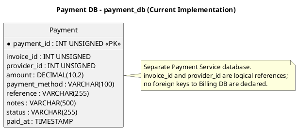
```plantuml
@startuml
' ER - Payment DB
title Payment DB - payment_db (Current Implementation)

hide circle
skinparam linetype ortho

entity "Payment" as Payment {
  * payment_id : INT UNSIGNED <<PK>>
  --
  invoice_id : INT UNSIGNED
  provider_id : INT UNSIGNED
  amount : DECIMAL(10,2)
  payment_method : VARCHAR(100)
  reference : VARCHAR(255)
  notes : VARCHAR(500)
  status : VARCHAR(255)
  paid_at : TIMESTAMP
}

note right of Payment
Separate Payment Service database.
invoice_id and provider_id are logical references;
no foreign keys to Billing DB are declared.
end note

@enduml
```

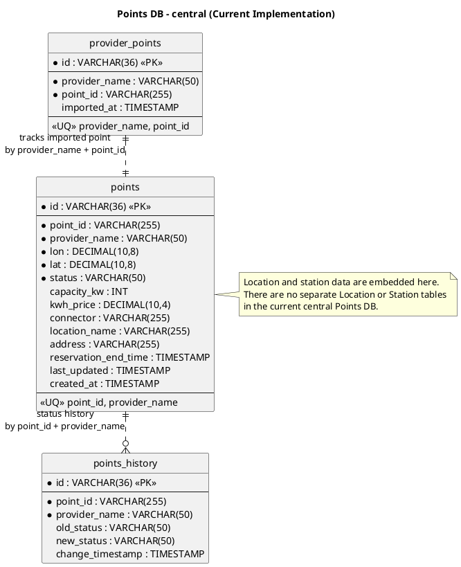
```plantuml
@startuml
' ER - Points DB / central
title Points DB - central (Current Implementation)

hide circle
skinparam linetype ortho

entity "points" as points {
  * id : VARCHAR(36) <<PK>>
  --
  * point_id : VARCHAR(255)
  * provider_name : VARCHAR(50)
  * lon : DECIMAL(10,8)
  * lat : DECIMAL(10,8)
  * status : VARCHAR(50)
  capacity_kw : INT
  kwh_price : DECIMAL(10,4)
  connector : VARCHAR(255)
  location_name : VARCHAR(255)
  address : VARCHAR(255)
  reservation_end_time : TIMESTAMP
  last_updated : TIMESTAMP
  created_at : TIMESTAMP
  --
  <<UQ>> point_id, provider_name
}

entity "points_history" as points_history {
  * id : VARCHAR(36) <<PK>>
  --
  * point_id : VARCHAR(255)
  * provider_name : VARCHAR(50)
  old_status : VARCHAR(50)
  new_status : VARCHAR(50)
  change_timestamp : TIMESTAMP
}

entity "provider_points" as provider_points {
  * id : VARCHAR(36) <<PK>>
  --
  * provider_name : VARCHAR(50)
  * point_id : VARCHAR(255)
  imported_at : TIMESTAMP
  --
  <<UQ>> provider_name, point_id
}

points ||..o{ points_history : "status history\nby point_id + provider_name"
provider_points ||..|| points : "tracks imported point\nby provider_name + point_id"

note right of points
Location and station data are embedded here.
There are no separate Location or Station tables
in the current central Points DB.
end note

@enduml
```

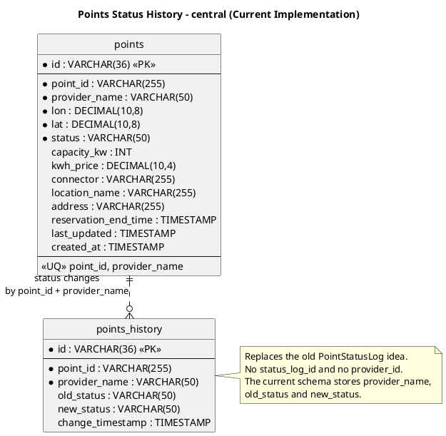
```plantuml
@startuml
' ER - Points Status Log / current equivalent
title Points Status History - central (Current Implementation)

hide circle
skinparam linetype ortho

entity "points" as points {
  * id : VARCHAR(36) <<PK>>
  --
  * point_id : VARCHAR(255)
  * provider_name : VARCHAR(50)
  * lon : DECIMAL(10,8)
  * lat : DECIMAL(10,8)
  * status : VARCHAR(50)
  capacity_kw : INT
  kwh_price : DECIMAL(10,4)
  connector : VARCHAR(255)
  location_name : VARCHAR(255)
  address : VARCHAR(255)
  reservation_end_time : TIMESTAMP
  last_updated : TIMESTAMP
  created_at : TIMESTAMP
  --
  <<UQ>> point_id, provider_name
}

entity "points_history" as points_history {
  * id : VARCHAR(36) <<PK>>
  --
  * point_id : VARCHAR(255)
  * provider_name : VARCHAR(50)
  old_status : VARCHAR(50)
  new_status : VARCHAR(50)
  change_timestamp : TIMESTAMP
}

points ||..o{ points_history : "status changes\nby point_id + provider_name"

note right of points_history
Replaces the old PointStatusLog idea.
No status_log_id and no provider_id.
The current schema stores provider_name,
old_status and new_status.
end note

@enduml
```

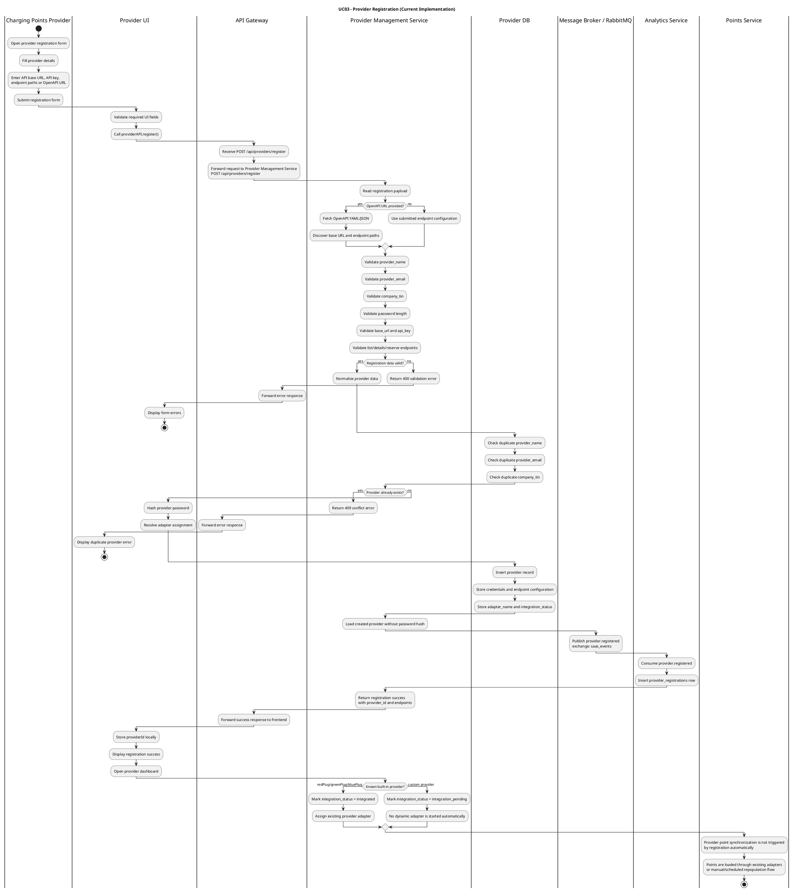
```plantuml
@startuml
' UC03 - Provider Registration
title UC03 - Provider Registration (Current Implementation)

|Charging Points Provider|
start
:Open provider registration form;
:Fill provider details;
:Enter API base URL, API key,\nendpoint paths or OpenAPI URL;
:Submit registration form;

|Provider UI|
:Validate required UI fields;
:Call providerAPI.register();

|API Gateway|
:Receive POST /api/providers/register;
:Forward request to Provider Management Service\nPOST /api/providers/register;

|Provider Management Service|
:Read registration payload;
if (OpenAPI URL provided?) then (yes)
  :Fetch OpenAPI YAML/JSON;
  :Discover base URL and endpoint paths;
else (no)
  :Use submitted endpoint configuration;
endif

:Validate provider_name;
:Validate provider_email;
:Validate company_tin;
:Validate password length;
:Validate base_url and api_key;
:Validate list/details/reserve endpoints;

if (Registration data valid?) then (yes)
  :Normalize provider data;
else (no)
  :Return 400 validation error;
  |API Gateway|
  :Forward error response;
  |Provider UI|
  :Display form errors;
  stop
endif

|Provider DB|
:Check duplicate provider_name;
:Check duplicate provider_email;
:Check duplicate company_tin;

|Provider Management Service|
if (Provider already exists?) then (yes)
  :Return 409 conflict error;
  |API Gateway|
  :Forward error response;
  |Provider UI|
  :Display duplicate provider error;
  stop
else (no)
  :Hash provider password;
  :Resolve adapter assignment;
endif

|Provider DB|
:Insert provider record;
:Store credentials and endpoint configuration;
:Store adapter_name and integration_status;

|Provider Management Service|
:Load created provider without password hash;

|Message Broker / RabbitMQ|
:Publish provider.registered\nexchange: saas_events;

|Analytics Service|
:Consume provider.registered;
:Insert provider_registrations row;

|Provider Management Service|
:Return registration success\nwith provider_id and endpoints;

|API Gateway|
:Forward success response to frontend;

|Provider UI|
:Store providerId locally;
:Display registration success;
:Open provider dashboard;

|Provider Management Service|
if (Known built-in provider?) then (redPlug/greenPlug/bluePlug)
  :Mark integration_status = integrated;
  :Assign existing provider adapter;
else (custom provider)
  :Mark integration_status = integration_pending;
  :No dynamic adapter is started automatically;
endif

|Points Service|
:Provider point synchronization is not triggered\nby registration automatically;
:Points are loaded through existing adapters\nor manual/scheduled repopulation flow;

stop
@enduml
```

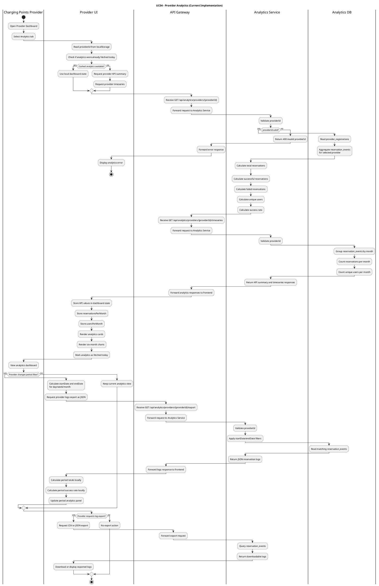
```plantuml
@startuml
' UC04 - Provider Analytics
title UC04 - Provider Analytics (Current Implementation)

|Charging Points Provider|
start
:Open Provider Dashboard;
:Select Analytics tab;

|Provider UI|
:Read providerId from localStorage;
:Check if analytics were already fetched today;

if (Cached analytics available?) then (yes)
  :Use local dashboard state;
else (no)
  :Request provider KPI summary;
  :Request provider timeseries;
endif

|API Gateway|
:Receive GET /api/analytics/providers/{providerId};
:Forward request to Analytics Service;

|Analytics Service|
:Validate providerId;

if (providerId valid?) then (yes)
  |Analytics DB|
  :Read provider_registrations;
  :Aggregate reservation_events\nfor selected provider;

  |Analytics Service|
  :Calculate total reservations;
  :Calculate successful reservations;
  :Calculate failed reservations;
  :Calculate unique users;
  :Calculate success rate;
else (no)
  :Return 400 invalid providerId;
  |API Gateway|
  :Forward error response;
  |Provider UI|
  :Display analytics error;
  stop
endif

|API Gateway|
:Receive GET /api/analytics/providers/{providerId}/timeseries;
:Forward request to Analytics Service;

|Analytics Service|
:Validate providerId;

|Analytics DB|
:Group reservation_events by month;
:Count reservations per month;
:Count unique users per month;

|Analytics Service|
:Return KPI summary and timeseries responses;

|API Gateway|
:Forward analytics responses to frontend;

|Provider UI|
:Store KPI values in dashboard state;
:Store reservationsPerMonth;
:Store usersPerMonth;
:Render analytics cards;
:Render six-month charts;
:Mark analytics as fetched today;

|Charging Points Provider|
:View analytics dashboard;

if (Provider changes period filter?) then (yes)
  |Provider UI|
  :Calculate startDate and endDate\nfor day/week/month;
  :Request provider logs export as JSON;

  |API Gateway|
  :Receive GET /api/analytics/providers/{providerId}/export;
  :Forward request to Analytics Service;

  |Analytics Service|
  :Validate providerId;
  :Apply startDate/endDate filters;

  |Analytics DB|
  :Read matching reservation_events;

  |Analytics Service|
  :Return JSON reservation logs;

  |API Gateway|
  :Forward logs response to frontend;

  |Provider UI|
  :Calculate period totals locally;
  :Calculate period success rate locally;
  :Update period analytics panel;
else (no)
  :Keep current analytics view;
endif

if (Provider requests log export?) then (yes)
  |Provider UI|
  :Request CSV or JSON export;

  |API Gateway|
  :Forward export request;

  |Analytics Service|
  :Query reservation_events;
  :Return downloadable logs;

  |Provider UI|
  :Download or display exported logs;
else (no)
  :No export action;
endif

stop
@enduml
```

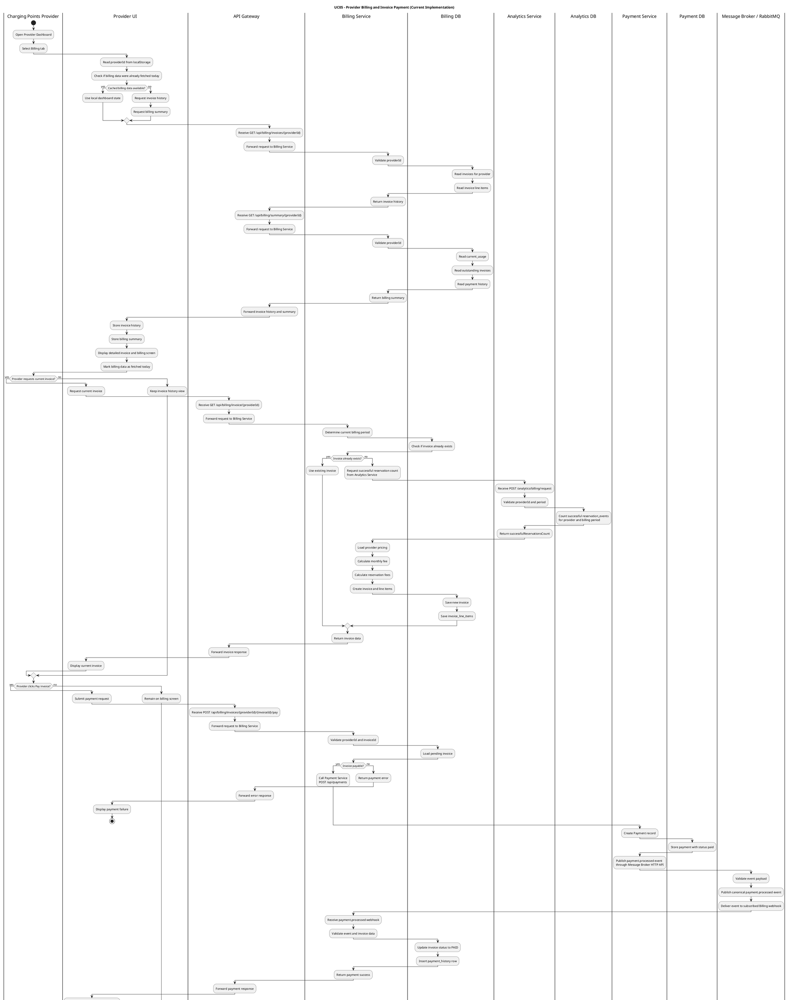
```plantuml
@startuml
' UC05 - Provider Billing and Invoice Payment
title UC05 - Provider Billing and Invoice Payment (Current Implementation)

|Charging Points Provider|
start
:Open Provider Dashboard;
:Select Billing tab;

|Provider UI|
:Read providerId from localStorage;
:Check if billing data were already fetched today;

if (Cached billing data available?) then (yes)
  :Use local dashboard state;
else (no)
  :Request invoice history;
  :Request billing summary;
endif

|API Gateway|
:Receive GET /api/billing/invoices/{providerId};
:Forward request to Billing Service;

|Billing Service|
:Validate providerId;

|Billing DB|
:Read invoices for provider;
:Read invoice line items;

|Billing Service|
:Return invoice history;

|API Gateway|
:Receive GET /api/billing/summary/{providerId};
:Forward request to Billing Service;

|Billing Service|
:Validate providerId;

|Billing DB|
:Read current_usage;
:Read outstanding invoices;
:Read payment history;

|Billing Service|
:Return billing summary;

|API Gateway|
:Forward invoice history and summary;

|Provider UI|
:Store invoice history;
:Store billing summary;
:Display detailed invoice and billing screen;
:Mark billing data as fetched today;

|Charging Points Provider|
if (Provider requests current invoice?) then (yes)
  |Provider UI|
  :Request current invoice;

  |API Gateway|
  :Receive GET /api/billing/invoice/{providerId};
  :Forward request to Billing Service;

  |Billing Service|
  :Determine current billing period;

  |Billing DB|
  :Check if invoice already exists;

  |Billing Service|
  if (Invoice already exists?) then (yes)
    :Use existing invoice;
  else (no)
    :Request successful reservation count\nfrom Analytics Service;

    |Analytics Service|
    :Receive POST /analytics/billing/request;
    :Validate providerId and period;

    |Analytics DB|
    :Count successful reservation_events\nfor provider and billing period;

    |Analytics Service|
    :Return successfulReservationsCount;

    |Billing Service|
    :Load provider pricing;
    :Calculate monthly fee;
    :Calculate reservation fees;
    :Create invoice and line items;

    |Billing DB|
    :Save new invoice;
    :Save invoice_line_items;
  endif

  |Billing Service|
  :Return invoice data;

  |API Gateway|
  :Forward invoice response;

  |Provider UI|
  :Display current invoice;
else (no)
  :Keep invoice history view;
endif

|Charging Points Provider|
if (Provider clicks Pay invoice?) then (yes)
  |Provider UI|
  :Submit payment request;

  |API Gateway|
  :Receive POST /api/billing/invoices/{providerId}/{invoiceId}/pay;
  :Forward request to Billing Service;

  |Billing Service|
  :Validate providerId and invoiceId;

  |Billing DB|
  :Load pending invoice;

  |Billing Service|
  if (Invoice payable?) then (yes)
    :Call Payment Service\nPOST /api/payments;
  else (no)
    :Return payment error;
    |API Gateway|
    :Forward error response;
    |Provider UI|
    :Display payment failure;
    stop
  endif

  |Payment Service|
  :Create Payment record;

  |Payment DB|
  :Store payment with status paid;

  |Payment Service|
  :Publish payment.processed event\nthrough Message Broker HTTP API;

  |Message Broker / RabbitMQ|
  :Validate event payload;
  :Publish canonical payment.processed event;
  :Deliver event to subscribed Billing webhook;

  |Billing Service|
  :Receive payment.processed webhook;
  :Validate event and invoice data;

  |Billing DB|
  :Update invoice status to PAID;
  :Insert payment_history row;

  |Billing Service|
  :Return payment success;

  |API Gateway|
  :Forward payment response;

  |Provider UI|
  :Refresh invoice history and summary;
  :Display payment successful;
else (no)
  |Provider UI|
  :Remain on billing screen;
endif

stop
@enduml
```

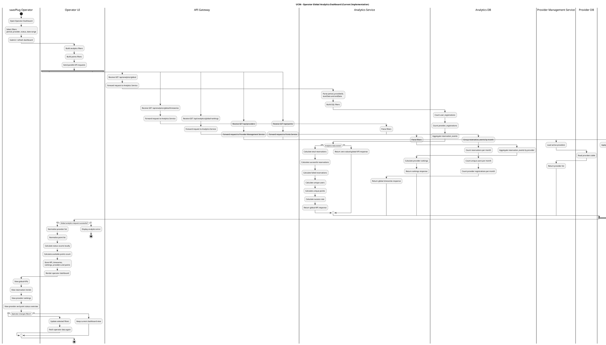
```plantuml
@startuml
' UC06 - Operator Global Analytics Dashboard
title UC06 - Operator Global Analytics Dashboard (Current Implementation)

|saasPlug Operator|
start
:Open Operator Dashboard;
:Select filters\nperiod, provider, status, date range;
:Submit / refresh dashboard;

|Operator UI|
:Build analytics filters;
:Build points filters;
:Send parallel API requests;

fork
  |API Gateway|
  :Receive GET /api/analytics/global;
  :Forward request to Analytics Service;

  |Analytics Service|
  :Parse period, providerId,\nstartDate and endDate;
  :Build SQL filters;

  |Analytics DB|
  :Count user_registrations;
  :Count provider_registrations;
  :Aggregate reservation_events;

  |Analytics Service|
  if (Analytics data exists?) then (yes)
    :Calculate total reservations;
    :Calculate successful reservations;
    :Calculate failed reservations;
    :Calculate unique users;
    :Calculate unique points;
    :Calculate success rate;
    :Return global KPI response;
  else (no)
    :Return zero-valued global KPI response;
  endif
fork again
  |API Gateway|
  :Receive GET /api/analytics/global/timeseries;
  :Forward request to Analytics Service;

  |Analytics Service|
  :Parse filters;

  |Analytics DB|
  :Group reservation_events by month;
  :Count reservations per month;
  :Count unique users per month;
  :Count provider registrations per month;

  |Analytics Service|
  :Return global timeseries response;
fork again
  |API Gateway|
  :Receive GET /api/analytics/global/rankings;
  :Forward request to Analytics Service;

  |Analytics Service|
  :Parse filters;

  |Analytics DB|
  :Aggregate reservation_events by provider;

  |Analytics Service|
  :Calculate provider rankings;
  :Return rankings response;
fork again
  |API Gateway|
  :Receive GET /api/providers;
  :Forward request to Provider Management Service;

  |Provider Management Service|
  :Load active providers;

  |Provider DB|
  :Read providers table;

  |Provider Management Service|
  :Return provider list;
fork again
  |API Gateway|
  :Receive GET /api/points;
  :Forward request to Points Service;

  |Points Service|
  :Apply provider and status filters;

  |Central Points DB|
  :Read matching charging points;

  |Points Service|
  :Return points list;
end fork

|Operator UI|
if (Global analytics request successful?) then (yes)
  :Normalize provider list;
  :Normalize point list;
  :Calculate status counts locally;
  :Calculate available points count;
  :Store KPI, timeseries,\nrankings, providers and points;
  :Render operator dashboard;
else (no)
  :Display analytics error;
  stop
endif

|saasPlug Operator|
:View global KPIs;
:View reservation trends;
:View provider rankings;
:View provider and point status overview;

if (Operator changes filters?) then (yes)
  |Operator UI|
  :Update selected filters;
  :Fetch operator data again;
else (no)
  :Keep current dashboard view;
endif

stop
@enduml
```

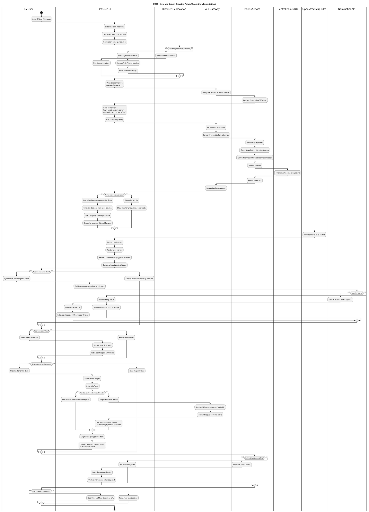
```plantuml
@startuml
' UC01 - View and Search Charging Points
title UC01 - View and Search Charging Points (Current Implementation)

|EV User|
start
:Open EV User Map page;

|EV User UI|
:Initialize React map view;
:Set default location to Athens;
:Request browser geolocation;

|Browser Geolocation|
if (Location permission granted?) then (yes)
  :Return user coordinates;
  |EV User UI|
  :Update userLocation;
else (no)
  :Return geolocation error;
  |EV User UI|
  :Keep default Athens location;
  :Show location warning;
endif

|EV User UI|
:Open SSE connection\n/api/points/events;

|API Gateway|
:Proxy SSE request to Points Service;

|Points Service|
:Register frontend as SSE client;

|EV User UI|
:Build point filters\nlat, lon, radius, cost, power,\navailability, connector, AC/DC;
:Call pointsAPI.getAll();

|API Gateway|
:Receive GET /api/points;
:Forward request to Points Service;

|Points Service|
:Validate query filters;
:Convert availability filters to statuses;
:Convert connector labels to connector codes;
:Build SQL query;

|Central Points DB|
:Fetch matching charging points;

|Points Service|
:Return points list;

|API Gateway|
:Forward points response;

|EV User UI|
if (Points response successful?) then (yes)
  :Normalize heterogeneous point fields;
  :Calculate distance from user location;
  :Sort charging points by distance;
  :Store chargers and filteredChargers;
else (no)
  :Clear charger list;
  :Show no charging points / error state;
endif

|OpenStreetMap Tiles|
:Provide map tiles to Leaflet;

|EV User UI|
:Render Leaflet map;
:Render user marker;
:Render clustered charging point markers;
:Color markers by outlet/status;

|EV User|
if (User searches location?) then (yes)
  :Type search text and press Enter;

  |EV User UI|
  :Call Nominatim geocoding API directly;

  |Nominatim API|
  if (Location found?) then (yes)
    :Return latitude and longitude;
    |EV User UI|
    :Update map center;
    :Fetch points again with new coordinates;
  else (no)
    :Return empty result;
    |EV User UI|
    :Show location not found message;
  endif
else (no)
  :Continue with current map location;
endif

|EV User|
if (User changes filters?) then (yes)
  :Select filters in sidebar;

  |EV User UI|
  :Update local filter state;
  :Fetch points again with filters;
else (no)
  :Keep current filters;
endif

|EV User|
if (User selects charging point?) then (yes)
  :Click marker or list item;

  |EV User UI|
  :Set selectedCharger;
  :Open InfoPanel;

  if (Point already contains outlet data?) then (yes)
    :Use outlet data from selected point;
  else (no)
    :Request location details;

    |API Gateway|
    :Receive GET /api/ui/location/{pointId};
    :Forward request if route exists;

    |EV User UI|
    :Use returned outlet details\nor show empty details on failure;
  endif

  :Display charging point details;
  :Display connector, power, price,\nstatus and distance;
else (no)
  :Keep map/list view;
endif

|Points Service|
if (Point status changes later?) then (yes)
  :Send SSE point update;

  |EV User UI|
  :Normalize updated point;
  :Update marker and selected panel;
else (no)
  :No realtime update;
endif

|EV User|
if (User requests navigation?) then (yes)
  |EV User UI|
  :Open Google Maps directions URL;
else (no)
  :Remain on point details;
endif

stop
@enduml
```

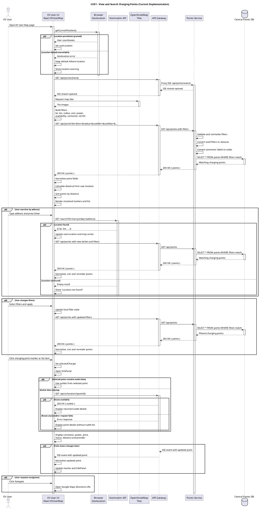
```plantuml
@startuml
' Sequence UC01 - View and Search Charging Points
title UC01 - View and Search Charging Points (Current Implementation)

actor "EV User" as User
participant "EV User UI\nReact EVUserMap" as UI
participant "Browser\nGeolocation" as Geo
participant "Nominatim API" as Nominatim
participant "OpenStreetMap\nTiles" as OSM
participant "API Gateway" as Gateway
participant "Points Service" as Points
database "Central Points DB" as PointsDB

User -> UI: Open EV User Map page
activate UI

UI -> Geo: getCurrentPosition()
activate Geo
alt Location permission granted
  Geo --> UI: User coordinates
  UI -> UI: Set userLocation
else Location denied/unavailable
  Geo --> UI: Geolocation error
  UI -> UI: Keep default Athens location
  UI -> UI: Show location warning
end
deactivate Geo

UI -> Gateway: GET /api/points/events
activate Gateway
Gateway -> Points: Proxy SSE /api/points/events
activate Points
Points --> Gateway: SSE stream opened
Gateway --> UI: SSE stream opened
deactivate Gateway

UI -> OSM: Request map tiles
activate OSM
OSM --> UI: Tile images
deactivate OSM

UI -> UI: Build filters\nlat, lon, radius, cost, power,\navailability, connector, AC/DC
UI -> Gateway: GET /api/points?lat=&lon=&radius=&costMin=&costMax=&...
activate Gateway
Gateway -> Points: GET /api/points with filters
activate Points
Points -> Points: Validate and normalize filters
Points -> Points: Convert avail filters to statuses
Points -> Points: Convert connector labels to codes
Points -> PointsDB: SELECT * FROM points WHERE filters match
activate PointsDB
PointsDB --> Points: Matching charging points
deactivate PointsDB
Points --> Gateway: 200 OK { points }
deactivate Points
Gateway --> UI: 200 OK { points }
deactivate Gateway

UI -> UI: Normalize point fields
UI -> UI: Calculate distance from user location
UI -> UI: Sort points by distance
UI -> UI: Render clustered markers and list

alt User searches by address
  User -> UI: Type address and press Enter
  UI -> Nominatim: GET /search?format=json&q={address}
  activate Nominatim
  alt Location found
    Nominatim --> UI: [{ lat, lon, ... }]
    UI -> UI: Update userLocation and map center
    UI -> Gateway: GET /api/points with new lat/lon and filters
    activate Gateway
    Gateway -> Points: GET /api/points
    activate Points
    Points -> PointsDB: SELECT * FROM points WHERE filters match
    activate PointsDB
    PointsDB --> Points: Matching charging points
    deactivate PointsDB
    Points --> Gateway: 200 OK { points }
    deactivate Points
    Gateway --> UI: 200 OK { points }
    deactivate Gateway
    UI -> UI: Normalize, sort and rerender points
  else Location not found
    Nominatim --> UI: Empty result
    UI -> UI: Show "Location not found"
  end
  deactivate Nominatim
end

alt User changes filters
  User -> UI: Select filters and apply
  UI -> UI: Update local filter state
  UI -> Gateway: GET /api/points with updated filters
  activate Gateway
  Gateway -> Points: GET /api/points
  activate Points
  Points -> PointsDB: SELECT * FROM points WHERE filters match
  activate PointsDB
  PointsDB --> Points: Filtered charging points
  deactivate PointsDB
  Points --> Gateway: 200 OK { points }
  deactivate Points
  Gateway --> UI: 200 OK { points }
  deactivate Gateway
  UI -> UI: Normalize, sort and rerender points
end

User -> UI: Click charging point marker or list item
UI -> UI: Set selectedCharger
UI -> UI: Open InfoPanel

alt Selected point contains outlet data
  UI -> UI: Use outlets from selected point
else Outlet data missing
  UI -> Gateway: GET /api/ui/location/{pointId}
  activate Gateway
  alt Route available
    Gateway --> UI: 200 OK { outlets }
    UI -> UI: Display returned outlet details
  else Route unavailable / request fails
    Gateway --> UI: Error response
    UI -> UI: Display point details without outlet list
  end
  deactivate Gateway
end

UI -> UI: Display connector, power, price,\nstatus, distance and provider

alt Point status changes later
  Points --> Gateway: SSE event with updated point
  Gateway --> UI: SSE event with updated point
  UI -> UI: Normalize updated point
  UI -> UI: Update marker and InfoPanel
end

alt User requests navigation
  User -> UI: Click Navigate
  UI -> UI: Open Google Maps directions URL
end

deactivate Points
deactivate UI
@enduml
```

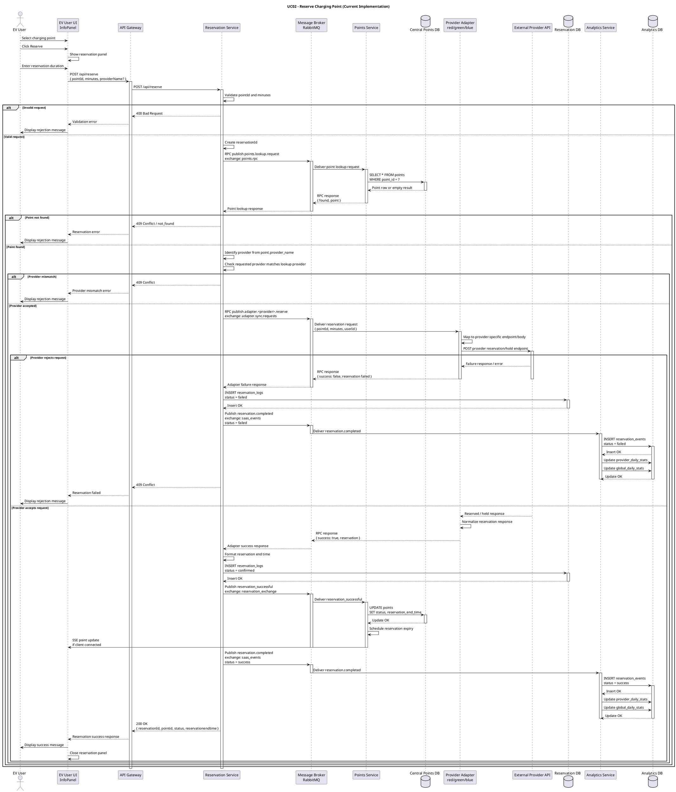
```plantuml
@startuml
' Sequence UC02 - Reserve Charging Point
title UC02 - Reserve Charging Point (Current Implementation)

actor "EV User" as User
participant "EV User UI\nInfoPanel" as UI
participant "API Gateway" as Gateway
participant "Reservation Service" as Reservation
participant "Message Broker\nRabbitMQ" as Rabbit
participant "Points Service" as Points
database "Central Points DB" as PointsDB
participant "Provider Adapter\nred/green/blue" as Adapter
participant "External Provider API" as ProviderAPI
database "Reservation DB" as ReservationDB
participant "Analytics Service" as Analytics
database "Analytics DB" as AnalyticsDB

User -> UI: Select charging point
User -> UI: Click Reserve
UI -> UI: Show reservation panel
User -> UI: Enter reservation duration

UI -> Gateway: POST /api/reserve\n{ pointId, minutes, providerName? }
activate Gateway
Gateway -> Reservation: POST /api/reserve
activate Reservation

Reservation -> Reservation: Validate pointId and minutes
alt Invalid request
  Reservation --> Gateway: 400 Bad Request
  Gateway --> UI: Validation error
  UI -> User: Display rejection message
else Valid request
  Reservation -> Reservation: Create reservationId

  Reservation -> Rabbit: RPC publish points.lookup.request\nexchange: points.rpc
  activate Rabbit
  Rabbit -> Points: Deliver point lookup request
  activate Points
  Points -> PointsDB: SELECT * FROM points\nWHERE point_id = ?
  activate PointsDB
  PointsDB --> Points: Point row or empty result
  deactivate PointsDB
  Points --> Rabbit: RPC response\n{ found, point }
  deactivate Points
  Rabbit --> Reservation: Point lookup response
  deactivate Rabbit

  alt Point not found
    Reservation --> Gateway: 409 Conflict / not_found
    Gateway --> UI: Reservation error
    UI -> User: Display rejection message
  else Point found
    Reservation -> Reservation: Identify provider from point.provider_name
    Reservation -> Reservation: Check requested provider matches lookup provider

    alt Provider mismatch
      Reservation --> Gateway: 409 Conflict
      Gateway --> UI: Provider mismatch error
      UI -> User: Display rejection message
    else Provider accepted
      Reservation -> Rabbit: RPC publish adapter.<provider>.reserve\nexchange: adapter.sync.requests
      activate Rabbit
      Rabbit -> Adapter: Deliver reservation request\n{ pointId, minutes, userId }
      activate Adapter
      Adapter -> Adapter: Map to provider-specific endpoint/body
      Adapter -> ProviderAPI: POST provider reservation/hold endpoint
      activate ProviderAPI

      alt Provider rejects request
        ProviderAPI --> Adapter: Failure response / error
        Adapter --> Rabbit: RPC response\n{ success: false, reservation failed }
        deactivate ProviderAPI
        deactivate Adapter
        Rabbit --> Reservation: Adapter failure response
        deactivate Rabbit

        Reservation -> ReservationDB: INSERT reservation_logs\nstatus = failed
        activate ReservationDB
        ReservationDB --> Reservation: Insert OK
        deactivate ReservationDB

        Reservation -> Rabbit: Publish reservation.completed\nexchange: saas_events\nstatus = failed
        activate Rabbit
        Rabbit -> Analytics: Deliver reservation.completed
        deactivate Rabbit
        activate Analytics
        Analytics -> AnalyticsDB: INSERT reservation_events\nstatus = failed
        activate AnalyticsDB
        AnalyticsDB --> Analytics: Insert OK
        Analytics -> AnalyticsDB: Update provider_daily_stats
        Analytics -> AnalyticsDB: Update global_daily_stats
        AnalyticsDB --> Analytics: Update OK
        deactivate AnalyticsDB
        deactivate Analytics

        Reservation --> Gateway: 409 Conflict
        Gateway --> UI: Reservation failed
        UI -> User: Display rejection message

      else Provider accepts request
        ProviderAPI --> Adapter: Reserved / held response
        Adapter -> Adapter: Normalize reservation response
        Adapter --> Rabbit: RPC response\n{ success: true, reservation }
        deactivate ProviderAPI
        deactivate Adapter
        Rabbit --> Reservation: Adapter success response
        deactivate Rabbit

        Reservation -> Reservation: Format reservation end time
        Reservation -> ReservationDB: INSERT reservation_logs\nstatus = confirmed
        activate ReservationDB
        ReservationDB --> Reservation: Insert OK
        deactivate ReservationDB

        Reservation -> Rabbit: Publish reservation_successful\nexchange: reservation_exchange
        activate Rabbit
        Rabbit -> Points: Deliver reservation_successful
        activate Points
        Points -> PointsDB: UPDATE points\nSET status, reservation_end_time
        activate PointsDB
        PointsDB --> Points: Update OK
        deactivate PointsDB
        Points -> Points: Schedule reservation expiry
        Points -> UI: SSE point update\nif client connected
        deactivate Points
        deactivate Rabbit

        Reservation -> Rabbit: Publish reservation.completed\nexchange: saas_events\nstatus = success
        activate Rabbit
        Rabbit -> Analytics: Deliver reservation.completed
        deactivate Rabbit
        activate Analytics
        Analytics -> AnalyticsDB: INSERT reservation_events\nstatus = success
        activate AnalyticsDB
        AnalyticsDB --> Analytics: Insert OK
        Analytics -> AnalyticsDB: Update provider_daily_stats
        Analytics -> AnalyticsDB: Update global_daily_stats
        AnalyticsDB --> Analytics: Update OK
        deactivate AnalyticsDB
        deactivate Analytics

        Reservation --> Gateway: 200 OK\n{ reservationId, pointid, status, reservationendtime }
        Gateway --> UI: Reservation success response
        UI -> User: Display success message
        UI -> UI: Close reservation panel
      end
    end
  end
end

deactivate Reservation
deactivate Gateway
@enduml
```

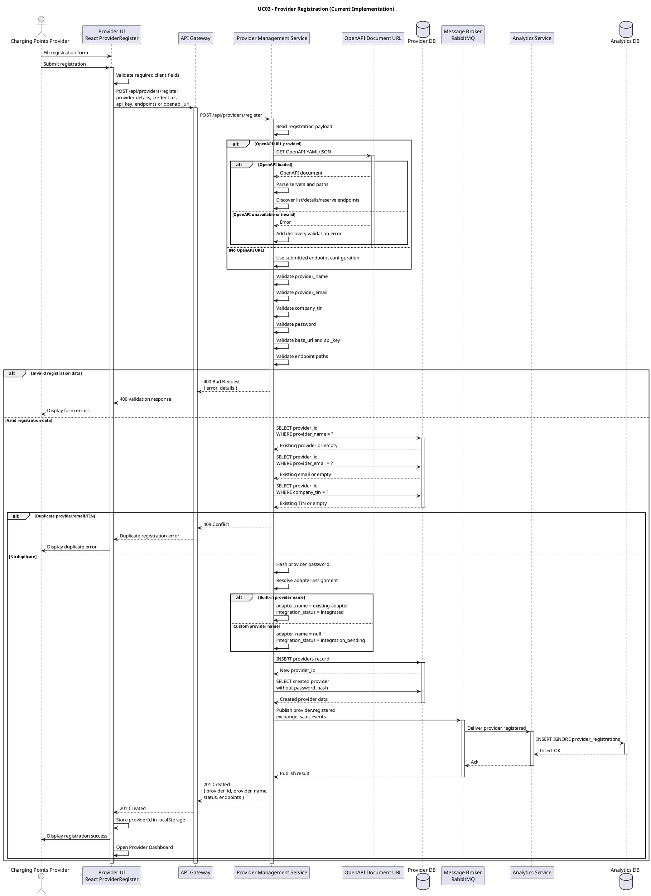
```plantuml
@startuml
' Sequence UC03 - Provider Registration
title UC03 - Provider Registration (Current Implementation)

actor "Charging Points Provider" as Provider
participant "Provider UI\nReact ProviderRegister" as UI
participant "API Gateway" as Gateway
participant "Provider Management Service" as ProviderMgmt
participant "OpenAPI Document URL" as OpenAPI
database "Provider DB" as ProviderDB
participant "Message Broker\nRabbitMQ" as Rabbit
participant "Analytics Service" as Analytics
database "Analytics DB" as AnalyticsDB

Provider -> UI: Fill registration form
Provider -> UI: Submit registration
activate UI

UI -> UI: Validate required client fields
UI -> Gateway: POST /api/providers/register\nprovider details, credentials,\napi_key, endpoints or openapi_url
activate Gateway
Gateway -> ProviderMgmt: POST /api/providers/register
activate ProviderMgmt

ProviderMgmt -> ProviderMgmt: Read registration payload

alt OpenAPI URL provided
  ProviderMgmt -> OpenAPI: GET OpenAPI YAML/JSON
  activate OpenAPI
  alt OpenAPI loaded
    OpenAPI --> ProviderMgmt: OpenAPI document
    ProviderMgmt -> ProviderMgmt: Parse servers and paths
    ProviderMgmt -> ProviderMgmt: Discover list/details/reserve endpoints
  else OpenAPI unavailable or invalid
    OpenAPI --> ProviderMgmt: Error
    ProviderMgmt -> ProviderMgmt: Add discovery validation error
  end
  deactivate OpenAPI
else No OpenAPI URL
  ProviderMgmt -> ProviderMgmt: Use submitted endpoint configuration
end

ProviderMgmt -> ProviderMgmt: Validate provider_name
ProviderMgmt -> ProviderMgmt: Validate provider_email
ProviderMgmt -> ProviderMgmt: Validate company_tin
ProviderMgmt -> ProviderMgmt: Validate password
ProviderMgmt -> ProviderMgmt: Validate base_url and api_key
ProviderMgmt -> ProviderMgmt: Validate endpoint paths

alt Invalid registration data
  ProviderMgmt --> Gateway: 400 Bad Request\n{ error, details }
  Gateway --> UI: 400 validation response
  UI -> Provider: Display form errors
else Valid registration data
  ProviderMgmt -> ProviderDB: SELECT provider_id\nWHERE provider_name = ?
  activate ProviderDB
  ProviderDB --> ProviderMgmt: Existing provider or empty

  ProviderMgmt -> ProviderDB: SELECT provider_id\nWHERE provider_email = ?
  ProviderDB --> ProviderMgmt: Existing email or empty

  ProviderMgmt -> ProviderDB: SELECT provider_id\nWHERE company_tin = ?
  ProviderDB --> ProviderMgmt: Existing TIN or empty
  deactivate ProviderDB

  alt Duplicate provider/email/TIN
    ProviderMgmt --> Gateway: 409 Conflict
    Gateway --> UI: Duplicate registration error
    UI -> Provider: Display duplicate error
  else No duplicate
    ProviderMgmt -> ProviderMgmt: Hash provider password
    ProviderMgmt -> ProviderMgmt: Resolve adapter assignment

    alt Built-in provider name
      ProviderMgmt -> ProviderMgmt: adapter_name = existing adapter\nintegration_status = integrated
    else Custom provider name
      ProviderMgmt -> ProviderMgmt: adapter_name = null\nintegration_status = integration_pending
    end

    ProviderMgmt -> ProviderDB: INSERT providers record
    activate ProviderDB
    ProviderDB --> ProviderMgmt: New provider_id
    ProviderMgmt -> ProviderDB: SELECT created provider\nwithout password_hash
    ProviderDB --> ProviderMgmt: Created provider data
    deactivate ProviderDB

    ProviderMgmt -> Rabbit: Publish provider.registered\nexchange: saas_events
    activate Rabbit
    Rabbit -> Analytics: Deliver provider.registered
    activate Analytics
    Analytics -> AnalyticsDB: INSERT IGNORE provider_registrations
    activate AnalyticsDB
    AnalyticsDB --> Analytics: Insert OK
    deactivate AnalyticsDB
    Analytics --> Rabbit: Ack
    deactivate Analytics
    Rabbit --> ProviderMgmt: Publish result
    deactivate Rabbit

    ProviderMgmt --> Gateway: 201 Created\n{ provider_id, provider_name,\nstatus, endpoints }
    Gateway --> UI: 201 Created
    UI -> UI: Store providerId in localStorage
    UI -> Provider: Display registration success
    UI -> UI: Open Provider Dashboard
  end
end

deactivate ProviderMgmt
deactivate Gateway
deactivate UI
@enduml
```

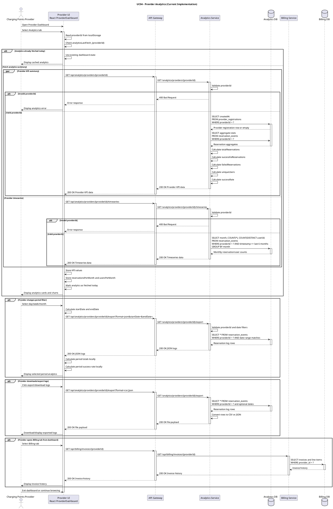
```plantuml
@startuml
' Sequence UC04 - Provider Analytics
title UC04 - Provider Analytics (Current Implementation)

actor "Charging Points Provider" as Provider
participant "Provider UI\nReact ProviderDashboard" as UI
participant "API Gateway" as Gateway
participant "Analytics Service" as Analytics
database "Analytics DB" as AnalyticsDB
participant "Billing Service" as Billing
database "Billing DB" as BillingDB

Provider -> UI: Open Provider Dashboard
Provider -> UI: Select Analytics tab
activate UI

UI -> UI: Read providerId from localStorage
UI -> UI: Check analyticsLastFetch_{providerId}

alt Analytics already fetched today
  UI -> UI: Use existing dashboard state
  UI -> Provider: Display cached analytics
else Fetch analytics summary
  par Provider KPI summary
    UI -> Gateway: GET /api/analytics/providers/{providerId}
    activate Gateway
    Gateway -> Analytics: GET /analytics/providers/{providerId}
    activate Analytics
    Analytics -> Analytics: Validate providerId

    alt Invalid providerId
      Analytics --> Gateway: 400 Bad Request
      Gateway --> UI: Error response
      UI -> Provider: Display analytics error
    else Valid providerId
      Analytics -> AnalyticsDB: SELECT createdAt\nFROM provider_registrations\nWHERE providerId = ?
      activate AnalyticsDB
      AnalyticsDB --> Analytics: Provider registration row or empty

      Analytics -> AnalyticsDB: SELECT aggregate stats\nFROM reservation_events\nWHERE providerId = ?
      AnalyticsDB --> Analytics: Reservation aggregates
      deactivate AnalyticsDB

      Analytics -> Analytics: Calculate totalReservations
      Analytics -> Analytics: Calculate successfulReservations
      Analytics -> Analytics: Calculate failedReservations
      Analytics -> Analytics: Calculate uniqueUsers
      Analytics -> Analytics: Calculate successRate
      Analytics --> Gateway: 200 OK Provider KPI data
      deactivate Analytics
      Gateway --> UI: 200 OK Provider KPI data
      deactivate Gateway
    end

  else Provider timeseries
    UI -> Gateway: GET /api/analytics/providers/{providerId}/timeseries
    activate Gateway
    Gateway -> Analytics: GET /analytics/providers/{providerId}/timeseries
    activate Analytics
    Analytics -> Analytics: Validate providerId

    alt Invalid providerId
      Analytics --> Gateway: 400 Bad Request
      Gateway --> UI: Error response
    else Valid providerId
      Analytics -> AnalyticsDB: SELECT month, COUNT(*), COUNT(DISTINCT userId)\nFROM reservation_events\nWHERE providerId = ? AND timestamp >= last 6 months\nGROUP BY month
      activate AnalyticsDB
      AnalyticsDB --> Analytics: Monthly reservation/user counts
      deactivate AnalyticsDB

      Analytics --> Gateway: 200 OK Timeseries data
      deactivate Analytics
      Gateway --> UI: 200 OK Timeseries data
      deactivate Gateway
    end
  end

  UI -> UI: Store KPI values
  UI -> UI: Store reservationsPerMonth and usersPerMonth
  UI -> UI: Mark analytics as fetched today
  UI -> Provider: Display analytics cards and charts
end

alt Provider changes period filter
  Provider -> UI: Select day/week/month
  UI -> UI: Calculate startDate and endDate
  UI -> Gateway: GET /api/analytics/providers/{providerId}/export?format=json&startDate=&endDate=
  activate Gateway
  Gateway -> Analytics: GET /analytics/providers/{providerId}/export
  activate Analytics
  Analytics -> Analytics: Validate providerId and date filters
  Analytics -> AnalyticsDB: SELECT * FROM reservation_events\nWHERE providerId = ? AND date range matches
  activate AnalyticsDB
  AnalyticsDB --> Analytics: Reservation log rows
  deactivate AnalyticsDB
  Analytics --> Gateway: 200 OK JSON logs
  deactivate Analytics
  Gateway --> UI: 200 OK JSON logs
  deactivate Gateway
  UI -> UI: Calculate period totals locally
  UI -> UI: Calculate period success rate locally
  UI -> Provider: Display selected period analytics
end

alt Provider downloads/export logs
  Provider -> UI: Click export/download logs
  UI -> Gateway: GET /api/analytics/providers/{providerId}/export?format=csv|json
  activate Gateway
  Gateway -> Analytics: GET /analytics/providers/{providerId}/export
  activate Analytics
  Analytics -> AnalyticsDB: SELECT * FROM reservation_events\nWHERE providerId = ? and optional dates
  activate AnalyticsDB
  AnalyticsDB --> Analytics: Reservation log rows
  deactivate AnalyticsDB
  Analytics -> Analytics: Convert rows to CSV or JSON
  Analytics --> Gateway: 200 OK file payload
  deactivate Analytics
  Gateway --> UI: 200 OK file payload
  deactivate Gateway
  UI -> Provider: Download/display exported logs
end

alt Provider opens Billing tab from dashboard
  Provider -> UI: Select Billing tab
  UI -> Gateway: GET /api/billing/invoices/{providerId}
  activate Gateway
  Gateway -> Billing: GET /api/billing/invoices/{providerId}
  activate Billing
  Billing -> BillingDB: SELECT invoices and line items\nWHERE provider_id = ?
  activate BillingDB
  BillingDB --> Billing: Invoice history
  deactivate BillingDB
  Billing --> Gateway: 200 OK Invoice history
  deactivate Billing
  Gateway --> UI: 200 OK Invoice history
  deactivate Gateway
  UI -> Provider: Display invoice history
end

Provider -> UI: Exit dashboard or continue browsing
deactivate UI
@enduml
```

```plantuml
@startuml
' Sequence UC05 - Billing Invoice and Payment
title UC05 - Billing Invoice and Payment (Current Implementation)

actor "Charging Points Provider" as Provider
participant "Provider UI\nReact ProviderDashboard" as UI
participant "API Gateway" as Gateway
participant "Billing Service" as Billing
database "Billing DB" as BillingDB
participant "Analytics Service" as Analytics
database "Analytics DB" as AnalyticsDB
participant "Payment Service" as Payment
database "Payment DB" as PaymentDB
participant "Message Broker\nHTTP + RabbitMQ" as Broker

Provider -> UI: Open Provider Dashboard
Provider -> UI: Select Billing tab
activate UI

UI -> UI: Read providerId from localStorage
UI -> UI: Check billingLastFetch_{providerId}

alt Billing data already fetched today
  UI -> UI: Use existing billing dashboard state
  UI -> Provider: Display cached invoices and summary
else Fetch billing data
  UI -> Gateway: GET /api/billing/invoices/{providerId}?limit=12
  activate Gateway
  Gateway -> Billing: GET /api/billing/invoices/{providerId}
  activate Billing
  Billing -> Billing: Validate providerId

  alt Invalid providerId
    Billing --> Gateway: 400 Bad Request
    Gateway --> UI: Error response
    UI -> Provider: Display invoice error
  else Valid providerId
    Billing -> BillingDB: SELECT * FROM invoices\nWHERE provider_id = ?\nORDER BY issued_at DESC
    activate BillingDB
    BillingDB --> Billing: Invoice rows
    deactivate BillingDB
    Billing --> Gateway: 200 OK invoice history
    deactivate Billing
    Gateway --> UI: 200 OK invoice history
    deactivate Gateway
  end

  UI -> Gateway: GET /api/billing/summary/{providerId}
  activate Gateway
  Gateway -> Billing: GET /api/billing/summary/{providerId}
  activate Billing
  Billing -> Billing: Validate providerId
  Billing -> BillingDB: SELECT current_usage,\noutstanding invoices,\npayment history
  activate BillingDB
  BillingDB --> Billing: Billing summary data
  deactivate BillingDB
  Billing --> Gateway: 200 OK billing summary
  deactivate Billing
  Gateway --> UI: 200 OK billing summary
  deactivate Gateway

  UI -> UI: Store invoice history
  UI -> UI: Store billing summary
  UI -> UI: Mark billing as fetched today
  UI -> Provider: Display billing screen
end

alt Provider requests current invoice
  Provider -> UI: Request current invoice
  UI -> Gateway: GET /api/billing/invoice/{providerId}
  activate Gateway
  Gateway -> Billing: GET /api/billing/invoice/{providerId}
  activate Billing
  Billing -> Billing: Validate providerId
  Billing -> Billing: Determine current billing period

  Billing -> BillingDB: SELECT invoice for provider\nand current billing period
  activate BillingDB
  BillingDB --> Billing: Existing invoice or empty
  deactivate BillingDB

  Billing -> Analytics: POST /analytics/billing/request\n{ providerId, periodStart, periodEnd }
  activate Analytics
  Analytics -> Analytics: Validate providerId and dates
  Analytics -> AnalyticsDB: SELECT COUNT(*) FROM reservation_events\nWHERE providerId = ? AND status = 'success'\nAND timestamp in billing period
  activate AnalyticsDB
  AnalyticsDB --> Analytics: successfulReservationsCount
  deactivate AnalyticsDB
  Analytics --> Billing: 200 OK billing stats
  deactivate Analytics

  Billing -> BillingDB: SELECT provider_pricing\nWHERE provider_id = ?
  activate BillingDB
  BillingDB --> Billing: Pricing row or default pricing
  deactivate BillingDB

  alt Invoice missing or unpaid
    Billing -> Billing: Calculate monthly fee and reservation fees
    Billing -> BillingDB: INSERT or UPDATE invoice
    activate BillingDB
    BillingDB --> Billing: Invoice saved
    Billing -> BillingDB: INSERT invoice_line_items
    BillingDB --> Billing: Line items saved
    deactivate BillingDB
  else Existing paid invoice
    Billing -> Billing: Keep existing paid invoice
  end

  Billing -> BillingDB: SELECT invoice_line_items\nWHERE invoice_id = ?
  activate BillingDB
  BillingDB --> Billing: Line items
  deactivate BillingDB
  Billing -> BillingDB: UPSERT current_usage
  activate BillingDB
  BillingDB --> Billing: Usage saved
  deactivate BillingDB

  Billing --> Gateway: 200 OK invoice DTO
  deactivate Billing
  Gateway --> UI: 200 OK invoice DTO
  deactivate Gateway
  UI -> Provider: Display detailed invoice
end

alt Provider pays invoice
  Provider -> UI: Click Pay invoice
  UI -> Gateway: POST /api/billing/invoices/{providerId}/{invoiceId}/pay\n{ paymentMethod }
  activate Gateway
  Gateway -> Billing: POST /api/billing/invoices/{providerId}/{invoiceId}/pay
  activate Billing
  Billing -> Billing: Validate providerId and invoiceId
  Billing -> BillingDB: SELECT * FROM invoices\nWHERE invoice_id = ? AND provider_id = ?
  activate BillingDB
  BillingDB --> Billing: Invoice row or empty
  deactivate BillingDB

  alt Invoice not found or already paid
    Billing --> Gateway: 400/404 payment error
    Gateway --> UI: Payment error
    UI -> Provider: Display payment failure
  else Invoice payable
    Billing -> Payment: POST /api/payments\n{ invoice_id, provider_id, amount, status: paid }
    activate Payment
    Payment -> PaymentDB: INSERT Payment
    activate PaymentDB
    PaymentDB --> Payment: payment_id
    Payment -> PaymentDB: SELECT created Payment
    PaymentDB --> Payment: Payment row
    deactivate PaymentDB

    Payment -> Broker: POST /api/events/publish\npayment.processed
    activate Broker
    Broker -> Broker: Validate canonical event
    Broker -> Billing: POST /api/webhooks/payment-processed
    activate Billing
    Billing -> Billing: Validate payment.processed payload
    Billing -> BillingDB: SELECT invoice\nWHERE invoice_id = ? AND provider_id = ?
    activate BillingDB
    BillingDB --> Billing: Invoice row
    Billing -> BillingDB: UPDATE invoices\nSET status = PAID, paid_at = CURRENT_TIMESTAMP
    BillingDB --> Billing: Invoice updated
    Billing -> BillingDB: INSERT payment_history
    BillingDB --> Billing: Payment history saved
    deactivate BillingDB
    Billing --> Broker: 200 OK webhook processed
    deactivate Billing
    Broker --> Payment: 201 Created event accepted
    deactivate Broker

    Payment --> Billing: 201 Created payment
    deactivate Payment

    Billing --> Gateway: 200 OK payment request forwarded
    deactivate Billing
    Gateway --> UI: 200 OK payment response
    deactivate Gateway

    UI -> Gateway: GET /api/billing/invoices/{providerId}?limit=12
    activate Gateway
    Gateway -> Billing: GET invoice history
    activate Billing
    Billing -> BillingDB: SELECT updated invoices
    activate BillingDB
    BillingDB --> Billing: Updated invoice rows
    deactivate BillingDB
    Billing --> Gateway: 200 OK invoice history
    deactivate Billing
    Gateway --> UI: 200 OK invoice history
    deactivate Gateway

    UI -> Gateway: GET /api/billing/summary/{providerId}
    activate Gateway
    Gateway -> Billing: GET billing summary
    activate Billing
    Billing -> BillingDB: SELECT updated summary data
    activate BillingDB
    BillingDB --> Billing: Updated summary
    deactivate BillingDB
    Billing --> Gateway: 200 OK billing summary
    deactivate Billing
    Gateway --> UI: 200 OK billing summary
    deactivate Gateway

    UI -> Provider: Display payment successful
  end
end

Provider -> UI: Exit billing screen or continue
deactivate UI
@enduml
```

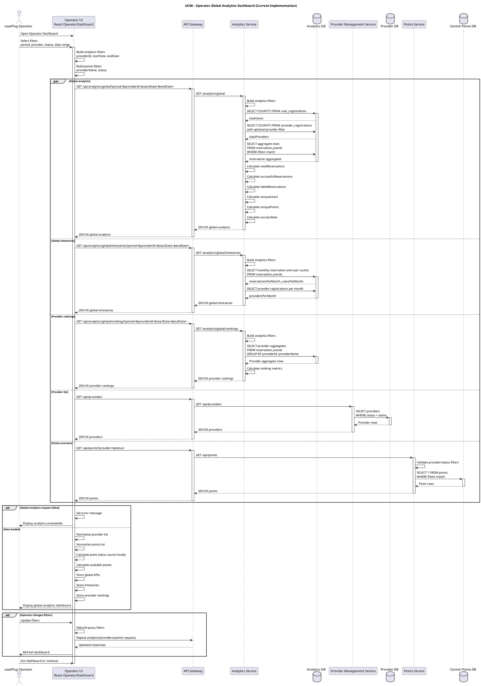
```plantuml
@startuml
' Sequence UC06 - Operator Global Analytics Dashboard
title UC06 - Operator Global Analytics Dashboard (Current Implementation)

actor "saasPlug Operator" as Operator
participant "Operator UI\nReact OperatorDashboard" as UI
participant "API Gateway" as Gateway
participant "Analytics Service" as Analytics
database "Analytics DB" as AnalyticsDB
participant "Provider Management Service" as ProviderMgmt
database "Provider DB" as ProviderDB
participant "Points Service" as Points
database "Central Points DB" as PointsDB

Operator -> UI: Open Operator Dashboard
Operator -> UI: Select filters\nperiod, provider, status, date range
activate UI

UI -> UI: Build analytics filters\nproviderId, startDate, endDate
UI -> UI: Build points filters\nproviderName, status

par Global analytics
  UI -> Gateway: GET /api/analytics/global?period=&providerId=&startDate=&endDate=
  activate Gateway
  Gateway -> Analytics: GET /analytics/global
  activate Analytics
  Analytics -> Analytics: Build analytics filters
  Analytics -> AnalyticsDB: SELECT COUNT(*) FROM user_registrations
  activate AnalyticsDB
  AnalyticsDB --> Analytics: totalUsers
  Analytics -> AnalyticsDB: SELECT COUNT(*) FROM provider_registrations\nwith optional provider filter
  AnalyticsDB --> Analytics: totalProviders
  Analytics -> AnalyticsDB: SELECT aggregate stats\nFROM reservation_events\nWHERE filters match
  AnalyticsDB --> Analytics: reservation aggregates
  deactivate AnalyticsDB
  Analytics -> Analytics: Calculate totalReservations
  Analytics -> Analytics: Calculate successfulReservations
  Analytics -> Analytics: Calculate failedReservations
  Analytics -> Analytics: Calculate uniqueUsers
  Analytics -> Analytics: Calculate uniquePoints
  Analytics -> Analytics: Calculate successRate
  Analytics --> Gateway: 200 OK global analytics
  deactivate Analytics
  Gateway --> UI: 200 OK global analytics
  deactivate Gateway

else Global timeseries
  UI -> Gateway: GET /api/analytics/global/timeseries?period=&providerId=&startDate=&endDate=
  activate Gateway
  Gateway -> Analytics: GET /analytics/global/timeseries
  activate Analytics
  Analytics -> Analytics: Build analytics filters
  Analytics -> AnalyticsDB: SELECT monthly reservation and user counts\nFROM reservation_events
  activate AnalyticsDB
  AnalyticsDB --> Analytics: reservationsPerMonth, usersPerMonth
  Analytics -> AnalyticsDB: SELECT provider registrations per month
  AnalyticsDB --> Analytics: providersPerMonth
  deactivate AnalyticsDB
  Analytics --> Gateway: 200 OK global timeseries
  deactivate Analytics
  Gateway --> UI: 200 OK global timeseries
  deactivate Gateway

else Provider rankings
  UI -> Gateway: GET /api/analytics/global/rankings?period=&providerId=&startDate=&endDate=
  activate Gateway
  Gateway -> Analytics: GET /analytics/global/rankings
  activate Analytics
  Analytics -> Analytics: Build analytics filters
  Analytics -> AnalyticsDB: SELECT provider aggregates\nFROM reservation_events\nGROUP BY providerId, providerName
  activate AnalyticsDB
  AnalyticsDB --> Analytics: Provider aggregate rows
  deactivate AnalyticsDB
  Analytics -> Analytics: Calculate ranking metrics
  Analytics --> Gateway: 200 OK provider rankings
  deactivate Analytics
  Gateway --> UI: 200 OK provider rankings
  deactivate Gateway

else Provider list
  UI -> Gateway: GET /api/providers
  activate Gateway
  Gateway -> ProviderMgmt: GET /api/providers
  activate ProviderMgmt
  ProviderMgmt -> ProviderDB: SELECT providers\nWHERE status = active
  activate ProviderDB
  ProviderDB --> ProviderMgmt: Provider rows
  deactivate ProviderDB
  ProviderMgmt --> Gateway: 200 OK providers
  deactivate ProviderMgmt
  Gateway --> UI: 200 OK providers
  deactivate Gateway

else Points overview
  UI -> Gateway: GET /api/points?provider=&status=
  activate Gateway
  Gateway -> Points: GET /api/points
  activate Points
  Points -> Points: Validate provider/status filters
  Points -> PointsDB: SELECT * FROM points\nWHERE filters match
  activate PointsDB
  PointsDB --> Points: Point rows
  deactivate PointsDB
  Points --> Gateway: 200 OK points
  deactivate Points
  Gateway --> UI: 200 OK points
  deactivate Gateway
end

alt Global analytics request failed
  UI -> UI: Set error message
  UI -> Operator: Display analytics unavailable
else Data loaded
  UI -> UI: Normalize provider list
  UI -> UI: Normalize points list
  UI -> UI: Calculate point status counts locally
  UI -> UI: Calculate available points
  UI -> UI: Store global KPIs
  UI -> UI: Store timeseries
  UI -> UI: Store provider rankings
  UI -> Operator: Display global analytics dashboard
end

alt Operator changes filters
  Operator -> UI: Update filters
  UI -> UI: Rebuild query filters
  UI -> Gateway: Repeat analytics/providers/points requests
  Gateway --> UI: Updated responses
  UI -> Operator: Refresh dashboard
end

Operator -> UI: Exit dashboard or continue
deactivate UI
@enduml
```

```plantuml
@startuml
' ER - Red Provider Adapter DB
title Red Provider Adapter DB - red_provider_db (Current Implementation)

hide circle
skinparam linetype ortho

entity "normalized_points" as red_normalized_points {
  * id : CHAR(36) <<PK>>
  --
  * point_id : VARCHAR(255) <<UQ>>
  * provider_name : VARCHAR(100)
  lon : DECIMAL(12,8)
  lat : DECIMAL(12,8)
  status : VARCHAR(50)
  capacity_kw : DECIMAL(10,2)
  kwh_price : DECIMAL(10,4)
  connector : VARCHAR(100)
  location_name : VARCHAR(255)
  address : VARCHAR(255)
  reservation_end_time : VARCHAR(64)
  raw_payload : LONGTEXT
  * last_synced_at : DATETIME(6)
  * created_at : DATETIME(6)
  * updated_at : DATETIME(6)
}

note right of red_normalized_points
Loaded by Provider_Adapter_redPlug/db/init.sql.
No foreign keys are declared in this adapter database.
end note
@enduml
```

```plantuml
@startuml
' ER - Green Provider Adapter DB
title Green Provider Adapter DB - green_provider_db (Current Implementation)

hide circle
skinparam linetype ortho

entity "normalized_points" as green_normalized_points {
  * id : CHAR(36) <<PK>>
  --
  * point_id : VARCHAR(255) <<UQ>>
  * provider_name : VARCHAR(100)
  lon : DECIMAL(12,8)
  lat : DECIMAL(12,8)
  status : VARCHAR(50)
  capacity_kw : DECIMAL(10,2)
  kwh_price : DECIMAL(10,4)
  connector : VARCHAR(100)
  location_name : VARCHAR(255)
  address : VARCHAR(255)
  reservation_end_time : VARCHAR(64)
  raw_payload : LONGTEXT
  * last_synced_at : DATETIME(6)
  * created_at : DATETIME(6)
  * updated_at : DATETIME(6)
}

note right of green_normalized_points
Loaded by Provider_Adapter_greenPlug/db/init.sql.
No foreign keys are declared in this adapter database.
end note
@enduml
```

```plantuml
@startuml
' ER - Blue Provider Adapter DB
title Blue Provider Adapter DB - blue_provider_db (Current Implementation)

hide circle
skinparam linetype ortho

entity "normalized_points" as blue_normalized_points {
  * id : CHAR(36) <<PK>>
  --
  * point_id : VARCHAR(255) <<UQ>>
  * provider_name : VARCHAR(100)
  lon : DECIMAL(12,8)
  lat : DECIMAL(12,8)
  status : VARCHAR(50)
  capacity_kw : DECIMAL(10,2)
  kwh_price : DECIMAL(10,4)
  connector : VARCHAR(100)
  location_name : VARCHAR(255)
  address : VARCHAR(255)
  reservation_end_time : VARCHAR(64)
  raw_payload : LONGTEXT
  * last_synced_at : DATETIME(6)
  * created_at : DATETIME(6)
  * updated_at : DATETIME(6)
}

note right of blue_normalized_points
Loaded by Provider_Adapter_bluePlug/db/init.sql.
No foreign keys are declared in this adapter database.
end note
@enduml
```
