# Final Submission – UML Diagrams for SaaS Plug

This document consolidates the requested UML artifacts for submission. The content is organized from the existing implementation-aligned diagram sources, and only the missing titles were added where needed.

---

## 1. Activity Diagrams

### UC01 – Search and View Charging Points

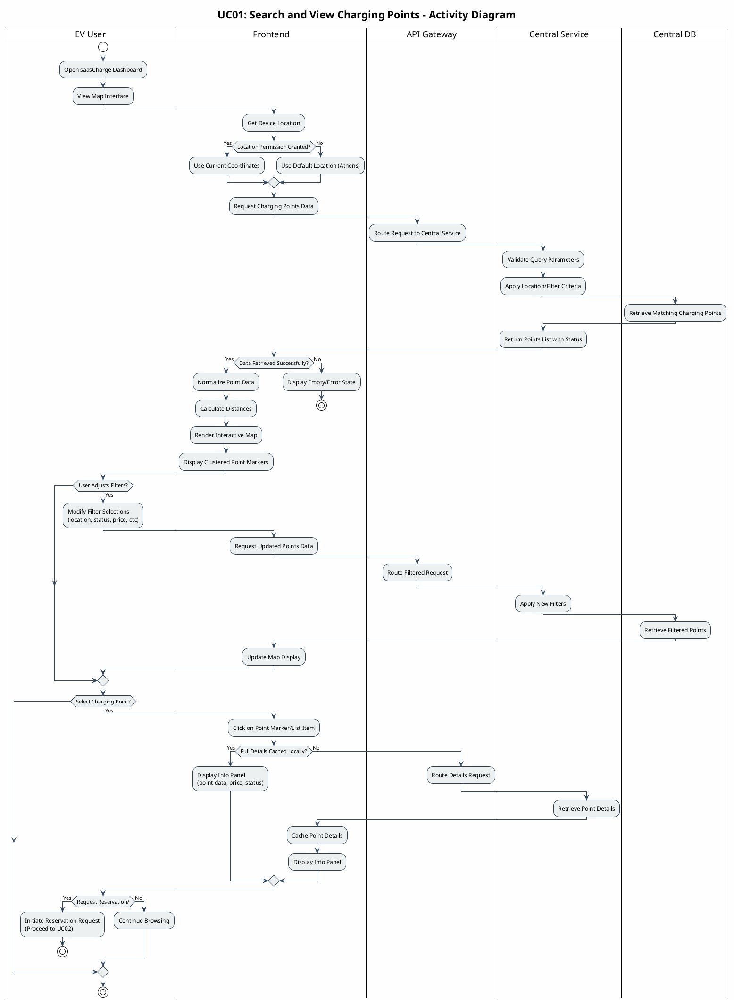

### UC02 – Reserve Charging Point

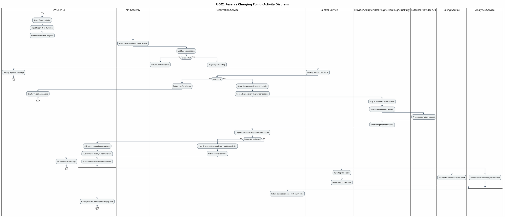

### UC03 – Provider Registration

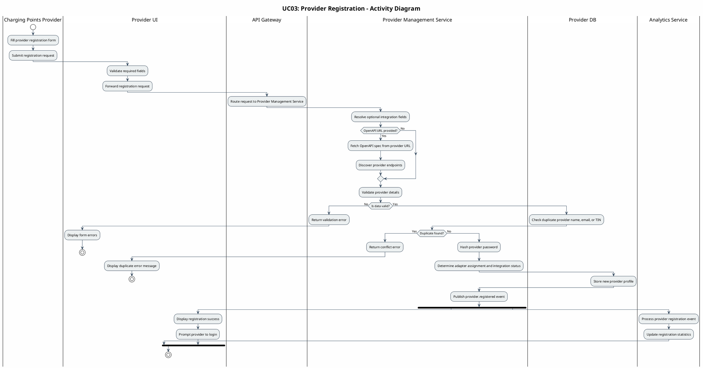

### UC04 – Provider Analytics

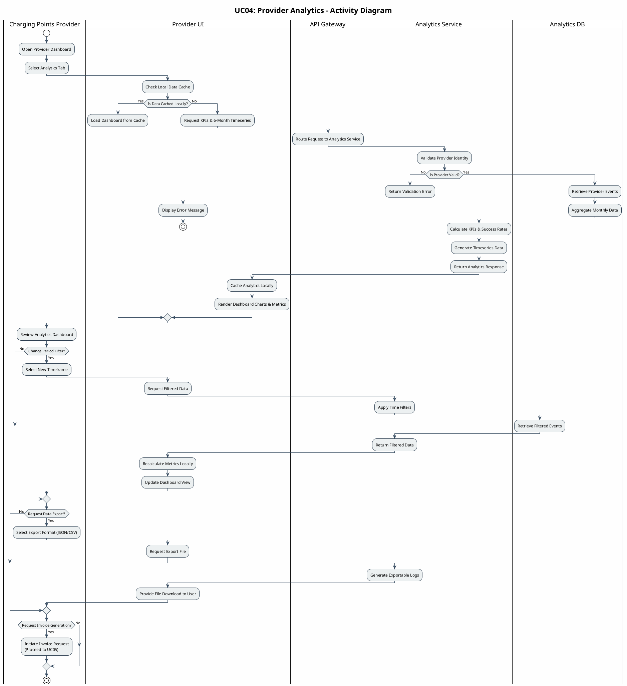

### UC05 – Provider Billing and Invoice View

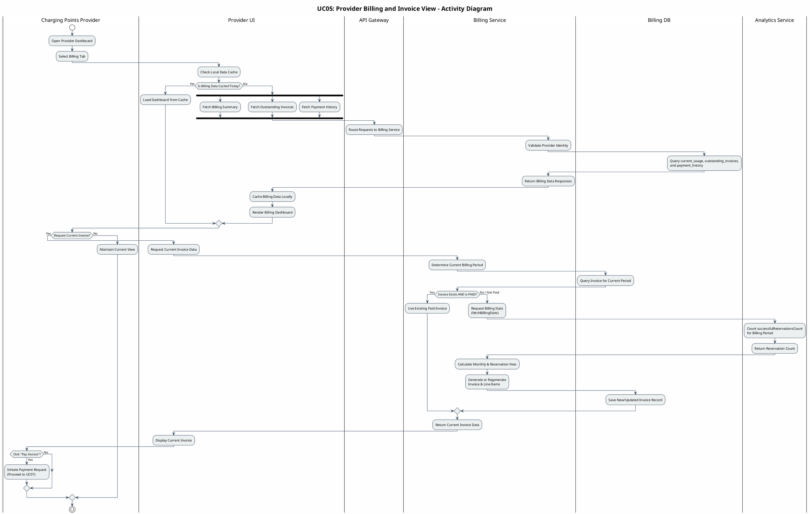

### UC06 – Operator Global Analytics Dashboard

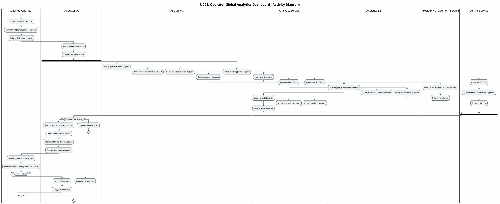

---

## 2. Sequence Diagrams

### UC01 – View and Search Charging Points

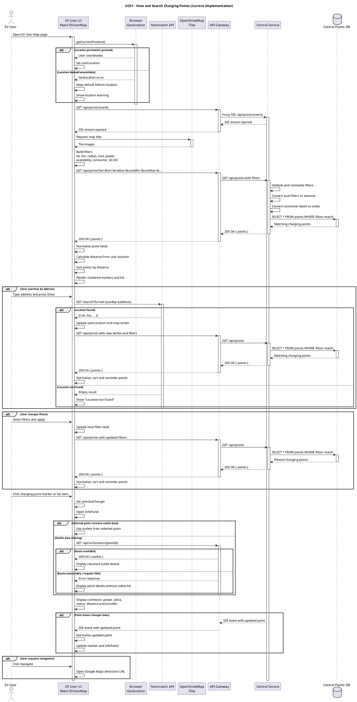

### UC02 – Reserve Charging Point

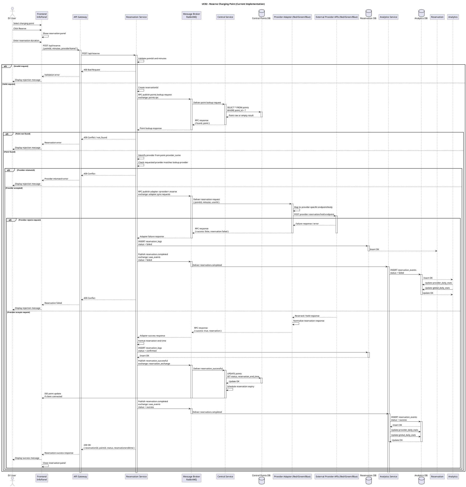

### UC03 – Provider Registration

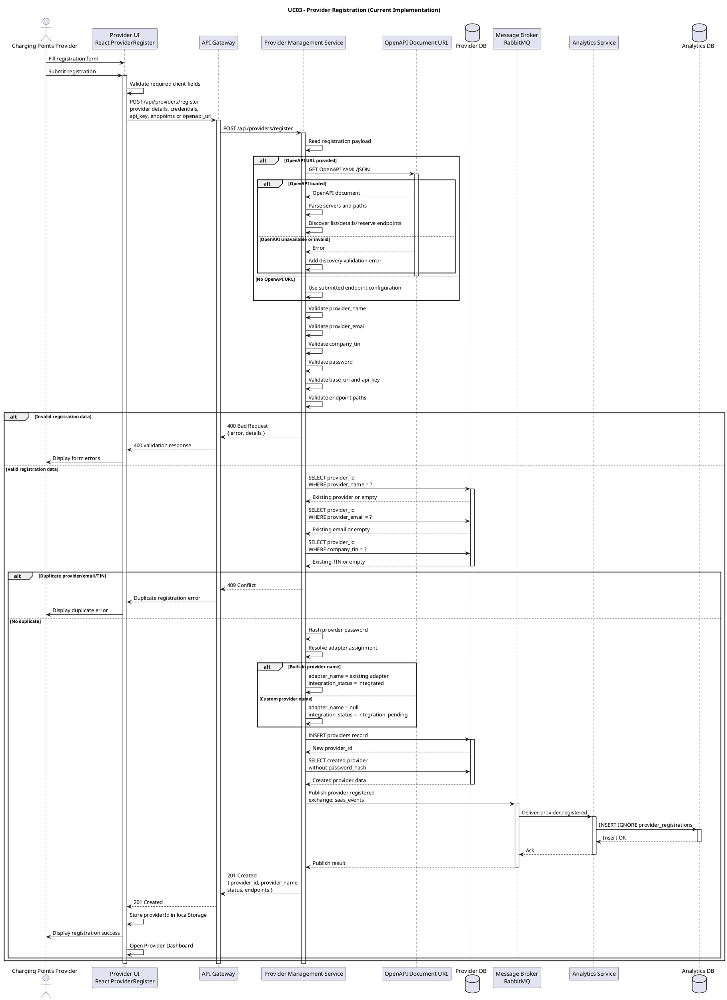

### UC04 – Provider Analytics

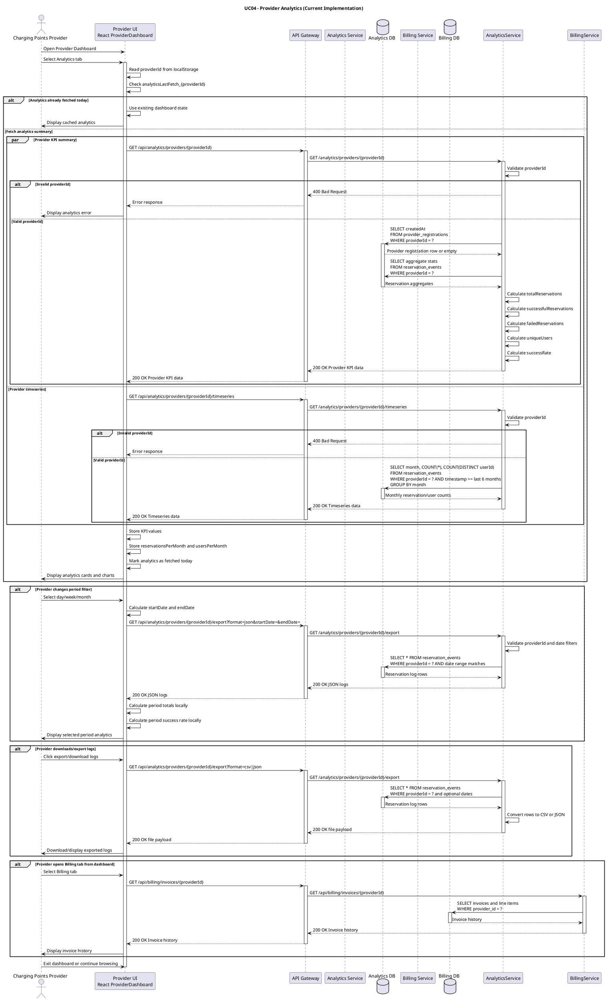

### UC05 – Billing Invoice and Payment

```plantuml
@startuml
' Sequence UC05 - Billing Invoice and Payment
title UC05 - Billing Invoice and Payment (Current Implementation)

actor "Charging Points Provider" as Provider
participant "Provider UI\nReact ProviderDashboard" as UI
participant "API Gateway" as ApiGateway
participant "Billing Service" as BillingService
database "Billing DB" as BillingDB
participant "Analytics Service" as AnalyticsService
database "Analytics DB" as AnalyticsDB
participant "Payment Service" as PaymentService
database "Payment DB" as PaymentDB
participant "Message Broker\nHTTP + RabbitMQ" as MessageBroker

Provider -> UI: Open Provider Dashboard
Provider -> UI: Select Billing tab
activate UI

UI -> UI: Read providerId from localStorage
UI -> UI: Check billingLastFetch_{providerId}

alt Billing data already fetched today
  UI -> UI: Use existing billing dashboard state
  UI -> Provider: Display cached invoices and summary
else Fetch billing data
  UI -> ApiGateway: GET /api/billing/invoices/{providerId}?limit=12
  activate ApiGateway
  ApiGateway -> BillingService: GET /api/billing/invoices/{providerId}
  activate BillingService
  BillingService -> BillingService: Validate providerId

  alt Invalid providerId
    BillingService --> ApiGateway: 400 Bad Request
    ApiGateway --> UI: Error response
    UI -> Provider: Display invoice error
  else Valid providerId
    BillingService -> BillingDB: SELECT * FROM invoices\nWHERE provider_id = ?\nORDER BY issued_at DESC
    activate BillingDB
    BillingDB --> BillingService: Invoice rows
    deactivate BillingDB
    BillingService --> ApiGateway: 200 OK invoice history
    deactivate BillingService
    ApiGateway --> UI: 200 OK invoice history
    deactivate ApiGateway
  end

  UI -> ApiGateway: GET /api/billing/summary/{providerId}
  activate ApiGateway
  ApiGateway -> BillingService: GET /api/billing/summary/{providerId}
  activate BillingService
  BillingService -> BillingService: Validate providerId
  BillingService -> BillingDB: SELECT current_usage,\noutstanding invoices,\npayment history
  activate BillingDB
  BillingDB --> BillingService: Billing summary data
  deactivate BillingDB
  BillingService --> ApiGateway: 200 OK billing summary
  deactivate BillingService
  ApiGateway --> UI: 200 OK billing summary
  deactivate ApiGateway

  UI -> UI: Store invoice history
  UI -> UI: Store billing summary
  UI -> UI: Mark billing as fetched today
  UI -> Provider: Display billing screen
end

alt Provider requests current invoice
  Provider -> UI: Request current invoice
  UI -> ApiGateway: GET /api/billing/invoice/{providerId}
  activate ApiGateway
  ApiGateway -> BillingService: GET /api/billing/invoice/{providerId}
  activate BillingService
  BillingService -> BillingService: Validate providerId
  BillingService -> BillingService: Determine current billing period

  BillingService -> BillingDB: SELECT invoice for provider\nand current billing period
  activate BillingDB
  BillingDB --> BillingService: Existing invoice or empty
  deactivate BillingDB

  BillingService -> AnalyticsService: POST /analytics/billing/request\n{ providerId, periodStart, periodEnd }
  activate AnalyticsService
  AnalyticsService -> AnalyticsService: Validate providerId and dates
  AnalyticsService -> AnalyticsDB: SELECT COUNT(*) FROM reservation_events\nWHERE providerId = ? AND status = 'success'\nAND timestamp in billing period
  activate AnalyticsDB
  AnalyticsDB --> AnalyticsService: successfulReservationsCount
  deactivate AnalyticsDB
  AnalyticsService --> BillingService: 200 OK billing stats
  deactivate AnalyticsService

  BillingService -> BillingDB: SELECT provider_pricing\nWHERE provider_id = ?
  activate BillingDB
  BillingDB --> BillingService: Pricing row or default pricing
  deactivate BillingDB

  alt Invoice missing or unpaid
    BillingService -> BillingService: Calculate monthly fee and reservation fees
    BillingService -> BillingDB: INSERT or UPDATE invoice
    activate BillingDB
    BillingDB --> BillingService: Invoice saved
    BillingService -> BillingDB: INSERT invoice_line_items
    BillingDB --> BillingService: Line items saved
    deactivate BillingDB
  else Existing paid invoice
    BillingService -> BillingService: Keep existing paid invoice
  end

  BillingService -> BillingDB: SELECT invoice_line_items\nWHERE invoice_id = ?
  activate BillingDB
  BillingDB --> BillingService: Line items
  deactivate BillingDB
  BillingService -> BillingDB: UPSERT current_usage
  activate BillingDB
  BillingDB --> BillingService: Usage saved
  deactivate BillingDB

  BillingService --> ApiGateway: 200 OK invoice DTO
  deactivate BillingService
  ApiGateway --> UI: 200 OK invoice DTO
  deactivate ApiGateway
  UI -> Provider: Display detailed invoice
end

alt Provider pays invoice
  Provider -> UI: Click Pay invoice
  UI -> ApiGateway: POST /api/billing/invoices/{providerId}/{invoiceId}/pay\n{ paymentMethod }
  activate ApiGateway
  ApiGateway -> BillingService: POST /api/billing/invoices/{providerId}/{invoiceId}/pay
  activate BillingService
  BillingService -> BillingService: Validate providerId and invoiceId
  BillingService -> BillingDB: SELECT * FROM invoices\nWHERE invoice_id = ? AND provider_id = ?
  activate BillingDB
  BillingDB --> Billing: Invoice row or empty
  deactivate BillingDB

  alt Invoice not found or already paid
    BillingService --> ApiGateway: 400/404 payment error
    ApiGateway --> UI: Payment error
    UI -> Provider: Display payment failure
  else Invoice payable
    Billing -> Payment: POST /api/payments\n{ invoice_id, provider_id, amount, status: paid }
    activate Payment
    Payment -> PaymentDB: INSERT Payment
    activate PaymentDB
    PaymentDB --> Payment: payment_id
    Payment -> PaymentDB: SELECT created Payment
    PaymentDB --> Payment: Payment row
    deactivate PaymentDB

    Payment -> Broker: POST /api/events/publish\npayment.processed
    activate Broker
    Broker -> Broker: Validate canonical event
    Broker -> BillingService: POST /api/webhooks/payment-processed
    activate BillingService
    Billing -> Billing: Validate payment.processed payload
    Billing -> BillingDB: SELECT invoice\nWHERE invoice_id = ? AND provider_id = ?
    activate BillingDB
    BillingDB --> Billing: Invoice row
    Billing -> BillingDB: UPDATE invoices\nSET status = PAID, paid_at = CURRENT_TIMESTAMP
    BillingDB --> Billing: Invoice updated
    Billing -> BillingDB: INSERT payment_history
    BillingDB --> Billing: Payment history saved
    deactivate BillingDB
    BillingService --> Broker: 200 OK webhook processed
    deactivate BillingService
    Broker --> Payment: 201 Created event accepted
    deactivate Broker

    Payment --> BillingService: 201 Created payment
    deactivate Payment

    BillingService --> ApiGateway: 200 OK payment request forwarded
    deactivate BillingService
    ApiGateway --> UI: 200 OK payment response
    deactivate ApiGateway

    UI -> ApiGateway: GET /api/billing/invoices/{providerId}?limit=12
    activate ApiGateway
    ApiGateway -> BillingService: GET invoice history
    activate BillingService
    BillingService -> BillingDB: SELECT updated invoices
    activate BillingDB
    BillingDB --> BillingService: Updated invoice rows
    deactivate BillingDB
    BillingService --> ApiGateway: 200 OK invoice history
    deactivate BillingService
    ApiGateway --> UI: 200 OK invoice history
    deactivate ApiGateway

    UI -> ApiGateway: GET /api/billing/summary/{providerId}
    activate ApiGateway
    ApiGateway -> BillingService: GET billing summary
    activate BillingService
    BillingService -> BillingDB: SELECT updated summary data
    activate BillingDB
    BillingDB --> BillingService: Updated summary
    deactivate BillingDB
    BillingService --> ApiGateway: 200 OK billing summary
    deactivate BillingService
    ApiGateway --> UI: 200 OK billing summary
    deactivate ApiGateway

    UI -> Provider: Display payment successful
  end
end

Provider -> UI: Exit billing screen or continue
deactivate UI
@enduml
```

### UC06 – Operator Global Analytics Dashboard

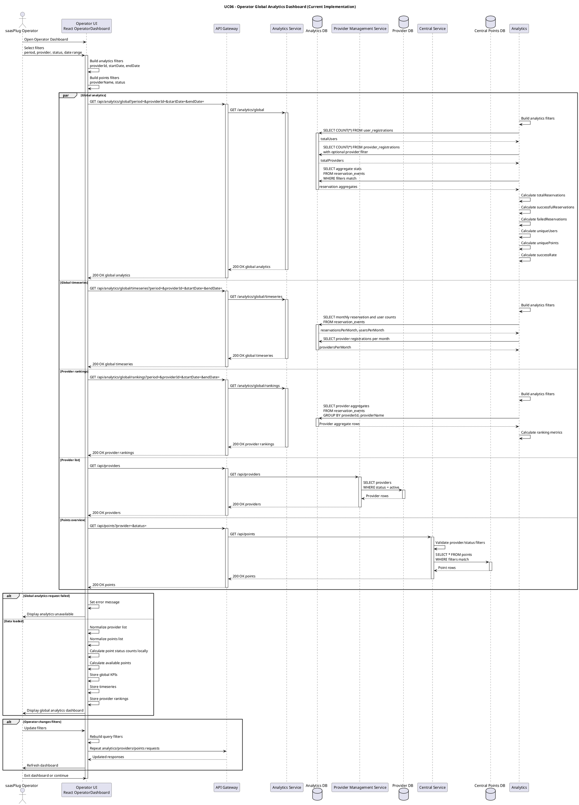

---

## 3. Class Diagrams

### API Class Diagram

```plantuml
@startuml API_ClassDiagram

!define ABSTRACT_COLOR #FFD700
!define SERVICE_COLOR #87CEEB
!define ENDPOINT_COLOR #98FB98

skinparam classBackgroundColor SERVICE_COLOR
skinparam classBorderColor #333333
skinparam classArrowColor #333333
skinparam ArrowColor #333333
skinparam shadowing false
skinparam defaultFontName Arial

title Service API Endpoints

package "SaaS System APIs" {

  class "API Gateway" as ApiGateway {
    --
    + GET /health
    + GET /api/status
  }

  class "Auth Service" as AuthService {
    --
    + POST /auth/register(username, password) : AuthResponseDTO
    + POST /auth/login(credentials) : AuthResponseDTO
    + POST /auth/logout() : void
    + GET /auth/validate(token) : UserProfileDTO
    + POST /auth/refresh(refreshToken) : AuthResponseDTO
    + GET /auth/profile(userId: integer) : UserProfileDTO
  }

  class "Provider Management Service" as ProviderMgmtService {
    --
    + POST /api/providers/register(data) : ProviderRegDTO
    + GET /api/providers/list() : List<ProviderProfileDTO>
    + GET /api/providers/profile(providerId) : ProviderProfileDTO
    + PATCH /api/providers/profile(providerId, data) : void
    + GET /api/providers/points(providerId) : List<PointDTO>
  }

  class "Central Service" as CentralService {
    --
    + GET /api/points/all(filters) : List<PointDTO>
    + GET /api/points/{id}(integer) : PointDTO
    + POST /api/points/filter(filters) : List<PointDTO>
    + GET /api/points/status(pointId) : StatusDTO
    + GET /ui/points(location, bounds) : List<PointDTO>
    + POST /api/points/subscribe(webhookUrl) : void
  }

  class "Reservation Service" as ReservationService {
    --
    + POST /api/reserve(data) : ReservationResponseDTO
    + POST /api/reservations(data) : ReservationResponseDTO
    + GET /api/reservations/{id}(integer) : ReservationResponseDTO
    + POST /api/reservations/{id}/confirm(userId) : StatusDTO
    + GET /api/reservations/user(userId) : List<ReservationResponseDTO>
    + GET /api/reservations/{id}/status(reservationId) : StatusDTO
  }

  class "Billing Service" as BillingService {
    --
    + GET /api/billing/invoices(userId, dateRange) : List<InvoiceDTO>
    + GET /api/billing/invoices/{id}(invoiceId) : InvoiceDTO
    + PATCH /api/billing/invoices/{id}/status(invoiceId, status) : void
    + POST /api/billing/process(invoiceId, paymentMethod) : void
    + GET /api/billing/summary(userId) : BillingStatDTO
  }

  class "Payment Service" as PaymentService {
    --
    + POST /api/payments/pay(invoiceId, method) : PaymentRedirectDTO
    + POST /api/payments/verify(transactionId) : PaymentStatusDTO
    + GET /api/payments/history(userId) : List<PaymentHistoryDTO>
    + GET /api/payments/{id}/status(paymentId) : PaymentStatusDTO
  }

  class "Analytics Service" as AnalyticsService {
    --
    + POST /api/analytics/track(eventType, data) : void
    + GET /api/analytics/stats() : AnalyticsStatsDTO
    + GET /api/analytics/global(timeRange) : GlobalStatsDTO
    + GET /api/analytics/search(userId) : integer
    + GET /api/analytics/clicks(userId) : integer
    + GET /api/analytics/reservations(userId) : integer
    + GET /api/analytics/export(format, timeRange) : File
  }

  class "Map Service" as MapService {
    --
    + GET /api/map/search(query) : List<PointDTO>
    + GET /api/map/nearby(lat, lon, radius) : List<PointDTO>
    + GET /api/map/bounds(northEastLat, bounds) : List<PointDTO>
    + GET /api/map/location(pointId) : LocationDTO
    + GET /api/map/distance(from, to) : DistanceDTO
  }

  class "Provider Adapter RedPlug" as RedAdapter {
    --
    + GET /api/adapter/points() : List<PointDTO>
    + POST /api/adapter/status(pointId) : StatusDTO
    + POST /api/adapter/reserve(data) : ReservationResponseDTO
  }

  class "Provider Adapter GreenPlug" as GreenAdapter {
    --
    + GET /api/adapter/points() : List<PointDTO>
    + POST /api/adapter/status(pointId) : StatusDTO
    + POST /api/adapter/reserve(data) : ReservationResponseDTO
  }

  class "Provider Adapter BluePlug" as BlueAdapter {
    --
    + GET /api/adapter/points() : List<PointDTO>
    + POST /api/adapter/status(pointId) : StatusDTO
    + POST /api/adapter/reserve(data) : ReservationResponseDTO
  }

  class "Message Broker Service" as MessageBrokerService {
    --
    + POST /publish(eventType, data) : EventResponseDTO
    + POST /subscribe(eventType, webhookUrl) : void
    + GET /diagnostics() : DiagnosticsDTO
    + POST /retry(eventId) : void
  }
}

ApiGateway --> AuthService : routes /auth/*
ApiGateway --> ProviderMgmtService : routes /api/providers*
ApiGateway --> CentralService : routes /api/points, /ui/*
ApiGateway --> ReservationService : routes /api/reservations*
ApiGateway --> BillingService : routes /api/billing*
ApiGateway --> PaymentService : routes /api/payments*
ApiGateway --> AnalyticsService : routes /api/analytics*
ApiGateway --> MapService : routes /api/map*

ReservationService --> RedAdapter : calls adapter endpoints
ReservationService --> GreenAdapter : calls adapter endpoints
ReservationService --> BlueAdapter : calls adapter endpoints

CentralService --> MessageBrokerService : publishes events
ReservationService --> MessageBrokerService : publishes events
BillingService --> MessageBrokerService : publishes events
AnalyticsService --> MessageBrokerService : subscribes events
BillingService --> PaymentService : triggers payment

@enduml
```

### Data Structures Class Diagram

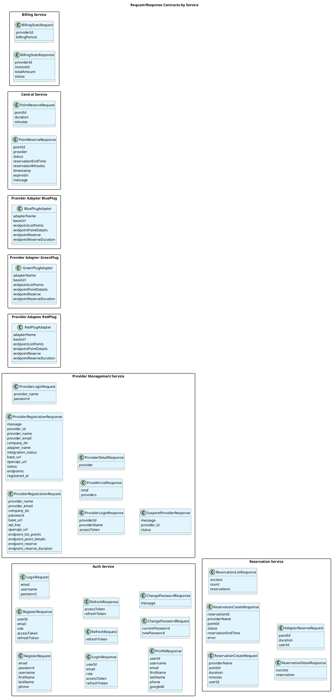

---

## 4. Component and Deployment Diagrams

### Component Diagram

```plantuml
@startuml
title Component Diagram

left to right direction
skinparam componentStyle rectangle
skinparam packageStyle rectangle
skinparam shadowing false
skinparam defaultFontName Arial
skinparam defaultTextAlignment center
skinparam componentFontSize 12
skinparam noteFontSize 12

package "User & External Systems" {
  component "Frontend\nhttps://github.com/ntua/saas26-11/tree/main/front-end" as Frontend
  component "External Provider APIs\nRed/Green/Blue" as ExternalProviders #LightBlue
}

package "SaaS System" {
  component "API Gateway\nhttps://github.com/ntua/saas26-11/tree/main/API_Gateway" as ApiGateway
  component "Auth Service\nhttps://github.com/ntua/saas26-11/tree/main/Auth_Service" as AuthService
  database "Auth DB\nhttps://github.com/ntua/saas26-11/tree/main/Auth_Service/db" as AuthDB
  component "Provider Management Service\nhttps://github.com/ntua/saas26-11/tree/main/Provider_Management_Service" as ProviderManagementService
  database "Provider DB\nhttps://github.com/ntua/saas26-11/tree/main/Provider_Management_Service/db" as ProviderDB
  component "Central Service\nhttps://github.com/ntua/saas26-11/tree/main/Points_Service" as CentralService
  database "Central DB\nhttps://github.com/ntua/saas26-11/tree/main/Points_Service/db" as CentralDB
  component "Reservation Service\nhttps://github.com/ntua/saas26-11/tree/main/Reservation_Service" as ReservationService
  database "Reservation DB\nhttps://github.com/ntua/saas26-11/tree/main/Reservation_Service/db" as ReservationDB
  component "Billing Service\nhttps://github.com/ntua/saas26-11/tree/main/Billing_Service" as BillingService
  database "Billing DB\nhttps://github.com/ntua/saas26-11/tree/main/Billing_Service/db" as BillingDB
  component "Analytics Service\nhttps://github.com/ntua/saas26-11/tree/main/Analytics_Service" as AnalyticsService
  database "Analytics DB\nhttps://github.com/ntua/saas26-11/tree/main/Analytics_Service/db" as AnalyticsDB
  component "Payment Service\nhttps://github.com/ntua/saas26-11/tree/main/Payment_Service" as PaymentService
  database "Payment DB\nhttps://github.com/ntua/saas26-11/tree/main/Payment_Service/db" as PaymentDB
  component "Map Service\nhttps://github.com/ntua/saas26-11/tree/main/Map_UI_Service" as MapService
  component "Provider Adapter RedPlug\nhttps://github.com/ntua/saas26-11/tree/main/Provider_Adapter_redPlug" as RedAdapter
  database "Red Provider DB\nhttps://github.com/ntua/saas26-11/tree/main/Provider_Adapter_redPlug/db" as RedDB
  component "Provider Adapter GreenPlug\nhttps://github.com/ntua/saas26-11/tree/main/Provider_Adapter_greenPlug" as GreenAdapter
  database "Green Provider DB\nhttps://github.com/ntua/saas26-11/tree/main/Provider_Adapter_greenPlug/db" as GreenDB
  component "Provider Adapter BluePlug\nhttps://github.com/ntua/saas26-11/tree/main/Provider_Adapter_bluePlug" as BlueAdapter
  database "Blue Provider DB\nhttps://github.com/ntua/saas26-11/tree/main/Provider_Adapter_bluePlug/db" as BlueDB
  component "Message Broker Service\nhttps://github.com/ntua/saas26-11/tree/main/message_broker" as MessageBroker
  component "RabbitMQ" as RabbitMQ
}

Frontend --> ApiGateway : HTTP / REST
ApiGateway --> AuthService : /auth/*
ApiGateway --> ProviderManagementService : /api/providers*
ApiGateway --> CentralService : /api/points, /ui/*
ApiGateway --> ReservationService : /api/reservations*
ApiGateway --> BillingService : /api/billing*
ApiGateway --> AnalyticsService : /api/analytics*
ApiGateway --> PaymentService : /api/payments*
ApiGateway --> MapService : /api/map*

AuthService --> AuthDB : user storage
ProviderManagementService --> ProviderDB : provider storage
CentralService --> CentralDB : point storage
ReservationService --> ReservationDB : reservation storage
BillingService --> BillingDB : billing storage
AnalyticsService --> AnalyticsDB : analytics storage
PaymentService --> PaymentDB : payment storage

ReservationService --> RedAdapter : REDPLUG_ADAPTER_URL
ReservationService --> GreenAdapter : GREENPLUG_ADAPTER_URL
ReservationService --> BlueAdapter : BLUEPLUG_ADAPTER_URL

RedAdapter --> RedDB : local provider storage
GreenAdapter --> GreenDB : local provider storage
BlueAdapter --> BlueDB : local provider storage

RedAdapter --> ExternalProviders : provider API
GreenAdapter --> ExternalProviders : provider API
BlueAdapter --> ExternalProviders : provider API

RedAdapter --> CentralService : sync points
GreenAdapter --> CentralService : sync points
BlueAdapter --> CentralService : sync points

BillingService --> PaymentService : payment processing

CentralService --> RabbitMQ : publish/subscribe
ReservationService --> RabbitMQ : publish/subscribe
BillingService --> RabbitMQ : publish/subscribe
AnalyticsService --> RabbitMQ : subscribe
MessageBroker --> RabbitMQ : relay

@enduml
```

### Deployment Diagram

```plantuml
@startuml
title Deployment Diagram

left to right direction
skinparam componentStyle rectangle
skinparam packageStyle rectangle
skinparam shadowing false
skinparam defaultFontName Arial
skinparam defaultTextAlignment center
skinparam componentFontSize 12
skinparam nodeFontSize 12
skinparam noteFontSize 12

actor "Browser / User" as Browser
actor "External Provider APIs\nRed/Green/Blue" as ExternalProviders

package "Docker Host / Docker Compose" {
  rectangle "Docker Network: saasplug-network" as Network {
    node "API Gateway Container\nHost Port: 4411" as ApiGatewayContainer {
      component "API Gateway\nPort: 4411" as ApiGatewayService
    }

    node "Frontend Service Container\nHost Port: 3311" as FrontendContainer {
      component "Frontend Service\nHost/Container Port: 3311" as FrontendServiceComponent
    }

    node "Auth Service Container\nHost Port: 5517" as AuthContainer {
      component "Auth Service\nPort: 3100" as AuthServiceComponent
    }

    node "Provider Management Container\nHost Port: 5516" as ProviderManagementContainer {
      component "Provider Management\nPort: 3101" as ProviderManagementComponent
    }

    node "Central Service Container\nHost Port: 5512" as CentralContainer {
      component "Central Service\nPort: 3001" as CentralServiceComponent
    }

    node "Reservation Service Container\nHost Port: 5513" as ReservationContainer {
      component "Reservation Service\nPort: 3009" as ReservationServiceComponent
    }

    node "Billing Service Container\nHost Port: 5514" as BillingContainer {
      component "Billing Service\nPort: 3103" as BillingServiceComponent
    }

    node "Payment Service Container\nHost Port: 5515" as PaymentContainer {
      component "Payment Service\nPort: 3107" as PaymentServiceComponent
    }

    node "Analytics Service Container\nHost Port: 5518" as AnalyticsContainer {
      component "Analytics Service\nPort: 3106" as AnalyticsServiceComponent
    }

    node "Map Service Container\nHost Port: 5519" as MapContainer {
      component "Map Service\nPort: 3105" as MapServiceComponent
    }

    node "Provider Adapter RedPlug Container\nHost Port: 5520" as RedAdapterContainer {
      component "Provider Adapter RedPlug\nPort: 3111" as RedAdapterServiceComponent
    }

    node "Provider Adapter GreenPlug Container\nHost Port: 5521" as GreenAdapterContainer {
      component "Provider Adapter GreenPlug\nPort: 3112" as GreenAdapterServiceComponent
    }

    node "Provider Adapter BluePlug Container\nHost Port: 5522" as BlueAdapterContainer {
      component "Provider Adapter BluePlug\nPort: 3113" as BlueAdapterServiceComponent
    }

    node "Message Broker Container\nHost Port: 5511" as MessageBrokerContainer {
      component "Message Broker\nPort: 3003" as MessageBrokerServiceComponent
    }

    node "RabbitMQ Container\nHost Ports: 5523/5672, 5524/15672" as RabbitMQContainer {
      component "RabbitMQ Broker\nPorts: 5672 (AMQP), 15672 (management)" as RabbitMQServiceComponent
    }

    node "Auth DB Container\nHost Port: 8311" as AuthDbContainer {
      component "Auth DB\nPort: 3306" as AuthDbService
    }

    node "Provider DB Container\nHost Port: 7411" as ProviderDbContainer {
      component "Provider DB\nPort: 3306" as ProviderDbService
    }

    node "Central DB Container\nHost Port: 6911" as CentralDbContainer {
      component "Central DB\nPort: 3306" as CentralDbService
    }

    node "Reservation DB Container\nHost Port: 7311" as ReservationDbContainer {
      component "Reservation DB\nPort: 3306" as ReservationDbService
    }

    node "Billing DB Container\nHost Port: 7911" as BillingDbContainer {
      component "Billing DB\nPort: 3306" as BillingDbService
    }

    node "Payment DB Container\nHost Port: 8111" as PaymentDbContainer {
      component "Payment DB\nPort: 3306" as PaymentDbService
    }

    node "Analytics DB Container\nHost Port: 8511" as AnalyticsDbContainer {
      component "Analytics DB\nPort: 3306" as AnalyticsDbService
    }

    node "Red Provider DB Container\nHost Port: 7011" as RedDbContainer {
      component "Red Provider DB\nPort: 3306" as RedDbService
    }

    node "Green Provider DB Container\nHost Port: 7111" as GreenDbContainer {
      component "Green Provider DB\nPort: 3306" as GreenDbService
    }

    node "Blue Provider DB Container\nHost Port: 7211" as BlueDbContainer {
      component "Blue Provider DB\nPort: 3306" as BlueDbService
    }
  }
}

@enduml
```

---

## 5. ER Diagram

```plantuml
@startuml ER_Diagrams

skinparam packageStyle rectangle
skinparam classBackgroundColor #F8F9FA
skinparam classBorderColor #333333
skinparam classArrowColor #333333
skinparam shadowing false
skinparam defaultFontName Arial

left to right direction
title ER Diagram by Database (based on current schema files)

package "Auth DB" {
  entity User {
    * user_id : int
    --
    username : varchar
    email : varchar
    password_hash : varchar
    google_id : varchar
    first_name : varchar
    last_name : varchar
    phone : varchar
    refresh_token_hash : varchar
    created_at : datetime
    updated_at : datetime
  }
}

package "Provider DB" {
  entity provider_points {
    * id : varchar(36)
    --
    point_id : varchar(255)
    lon : decimal
    lat : decimal
    status : varchar(50)
    capacity_kw : int
    kwh_price : decimal
    reservation_end_time : timestamp
    last_synced : timestamp
    created_at : timestamp
    updated_at : timestamp
  }

  entity provider_point_changes {
    * id : varchar(36)
    --
    point_id : varchar(255)
    field_name : varchar(100)
    old_value : varchar(255)
    new_value : varchar(255)
    changed_at : timestamp
  }

  provider_points ||--o{ provider_point_changes : point_id
}

package "Central DB" {
  entity points {
    * id : varchar(36)
    --
    point_id : varchar(255)
    provider_name : varchar(50)
    lon : decimal
    lat : decimal
    status : varchar(50)
    capacity_kw : int
    kwh_price : decimal
    connector : varchar(255)
    location_name : varchar(255)
    address : varchar
    reservation_end_time : timestamp
    last_updated : timestamp
    created_at : timestamp
  }

  entity points_history {
    * id : varchar(36)
    --
    point_id : varchar(255)
    provider_name : varchar(50)
    old_status : varchar(50)
    new_status : varchar(50)
    change_timestamp : timestamp
  }

  entity provider_points {
    * id : varchar(36)
    --
    provider_name : varchar(50)
    point_id : varchar(255)
    imported_at : timestamp
  }

  points ||--o{ points_history : point_id
  points ||--o{ provider_points : point_id
}

package "Reservation DB" {
  entity reservation_logs {
    * id : int
    --
    reservation_id : varchar(36)
    provider_id : int
    provider_name : varchar(50)
    point_id : varchar(100)
    duration : int
    user_id : varchar(36)
    status : varchar(50)
    reservation_details : json
    created_at : timestamp
    updated_at : timestamp
  }

  entity reservation_statistics {
    * id : int
    --
    date_key : date
    provider_id : int
    provider_name : varchar(50)
    total_reservations : int
    successful_reservations : int
    failed_reservations : int
    total_duration_minutes : int
    average_duration_minutes : int
    created_at : timestamp
    updated_at : timestamp
  }
}

package "Billing DB" {
  entity invoices {
    * invoice_id : int
    --
    provider_id : int
    billing_period_start : date
    billing_period_end : date
    successful_reservations_count : int
    monthly_fee : decimal
    reservation_price : decimal
    total_amount : decimal
    tax_amount : decimal
    grand_total : decimal
    status : varchar(50)
    issued_at : timestamp
    due_date : date
    paid_at : timestamp
  }

  entity invoice_line_items {
    * line_id : int
    --
    invoice_id : int
    description : varchar(255)
    quantity : int
    unit_price : decimal
    line_total : decimal
  }

  entity provider_pricing {
    * provider_id : int
    --
    monthly_fee : decimal
    reservation_price : decimal
    created_at : timestamp
    updated_at : timestamp
  }

  entity current_usage {
    * provider_id : int
    --
    billing_period : date
    successful_reservations : int
    monthly_fee : decimal
    reservation_price : decimal
    estimated_amount : decimal
    updated_at : timestamp
  }

  entity payment_history {
    * payment_id : int
    --
    invoice_id : int
    provider_id : int
    amount : decimal
    payment_method : varchar(50)
    reference : varchar(255)
    status : varchar(50)
    notes : varchar(500)
    paid_at : timestamp
  }

  invoices ||--o{ invoice_line_items : invoice_id
  invoices ||--o{ payment_history : invoice_id
  provider_pricing ||--o{ current_usage : provider_id
}

package "Payment DB" {
  entity Payment {
    * payment_id : int
    --
    invoice_id : int
    provider_id : int
    amount : decimal
    payment_method : varchar(100)
    reference : varchar(255)
    notes : varchar(500)
    status : varchar(255)
    paid_at : timestamp
  }
}

package "Analytics DB" {
  entity user_registrations {
    * id : int
    --
    userId : varchar(255)
    createdAt : timestamp
  }
}

@enduml
```
